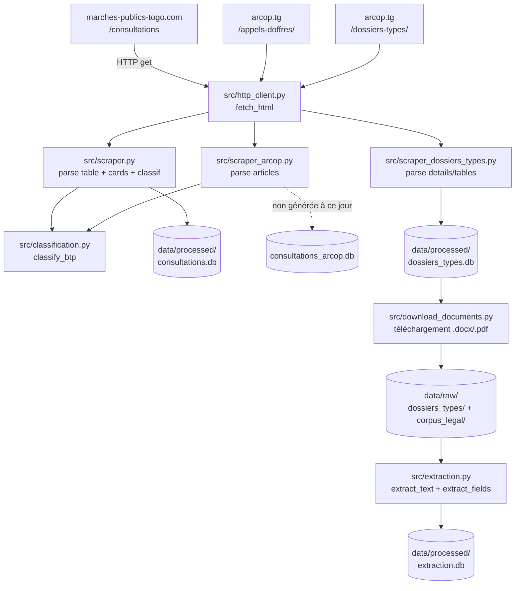

# Documentation complète — AO-BTP Copilot Togo

> **Rôle de ce document.** Ce n'est pas un README. C'est la mémoire technique,
> fonctionnelle, pédagogique et historique du projet : le document qu'une personne avec un
> faible bagage technique peut suivre intégralement pour
> comprendre, reproduire, modifier et poursuivre le projet — et idéalement reconstruire une
> solution équivalente.
>
> **Règle de fidélité.** Chaque affirmation de ce document est rattachée à une source
> (code, `PROGRESS.md`, historique Git, résultat d'exécution observé). Quand une information
> n'est pas déterminée, elle est marquée : **Information non déterminée dans l'état actuel du
> projet.** Quand une amélioration n'est pas encore codée, elle est marquée :
> **Amélioration proposée — non implémentée actuellement.**

---

## Table des matières

1. [Présentation du projet](#1-présentation-du-projet)
2. [Problème métier](#2-problème-métier)
3. [Objectifs](#3-objectifs)
4. [Utilisateurs cibles](#4-utilisateurs-cibles)
5. [Cas d'utilisation](#5-cas-dutilisation)
6. [Périmètre du MVP](#6-périmètre-du-mvp)
7. [Hors périmètre](#7-hors-périmètre)
8. [Vue d'ensemble fonctionnelle](#8-vue-densemble-fonctionnelle)
9. [Architecture globale](#9-architecture-globale)
10. [Flux de données end-to-end](#10-flux-de-données-end-to-end)
11. [Sources de données](#11-sources-de-données)
12. [Ingestion / Scraping](#12-ingestion--scraping)
13. [Extraction](#13-extraction)
14. [Normalisation](#14-normalisation)
15. [Stockage (SQLite)](#15-stockage-sqlite)
16. [Corpus juridique](#16-corpus-juridique)
17. [Préparation du corpus (chunking)](#17-préparation-du-corpus-chunking)
18. [Embeddings](#18-embeddings)
19. [FAISS](#19-faiss)
20. [Retrieval](#20-retrieval)
21. [Architecture RAG](#21-architecture-rag)
22. [LLM](#22-llm)
23. [Prompt Engineering](#23-prompt-engineering)
24. [Résumé des appels d'offres](#24-résumé-des-appels-doffres)
25. [Checklist d'éligibilité](#25-checklist-déligibilité)
26. [Citations et grounding](#26-citations-et-grounding)
27. [Chat Q&A](#27-chat-qa)
28. [Interface Streamlit](#28-interface-streamlit)
29. [Architecture du code](#29-architecture-du-code)
30. [Configuration](#30-configuration)
31. [Variables d'environnement](#31-variables-denvironnement)
32. [Installation](#32-installation)
33. [Exécution](#33-exécution)
34. [Tests](#34-tests)
35. [Validation end-to-end](#35-validation-end-to-end)
36. [Troubleshooting](#36-troubleshooting)
37. [Difficultés rencontrées et solutions](#37-difficultés-rencontrées-et-solutions)
38. [Décisions techniques](#38-décisions-techniques)
39. [Alternatives rejetées](#39-alternatives-rejetées)
40. [Raisonnement derrière les décisions](#40-raisonnement-derrière-les-décisions)
41. [Challenge des décisions](#41-challenge-des-décisions)
42. [Limites connues](#42-limites-connues)
43. [Risques](#43-risques)
44. [Sécurité et fiabilité](#44-sécurité-et-fiabilité)
45. [Historique du projet](#45-historique-du-projet)
46. [État actuel](#46-état-actuel)
47. [Roadmap](#47-roadmap)
48. [Améliorations futures](#48-améliorations-futures)
49. [Glossaire](#49-glossaire)
50. [Annexes](#50-annexes)

---

## 1. Présentation du projet

**AO-BTP Copilot Togo** est un outil logiciel qui récupère automatiquement les **avis
d'appel d'offres (AO)** du secteur BTP / Travaux publiés au Togo, en extrait les
informations importantes, puis doit produire — grâce à un système question/réponse basé sur
le **corpus légal togolais de la commande publique** — un **résumé**, une **checklist
d'éligibilité sourcée** (avec citation d'article) et un **chat de questions/réponses**
destiné à une petite ou moyenne entreprise (PME) du BTP.

| Élément | Valeur |
|---|---|
| Nom du projet | AO-BTP Copilot Togo |
| Dépôt Git | `https://github.com/AngeloEngineer/AO-BTP-Copilot.git` |
| Branche principale | `main` |
| Langage | Python 3.13.9 (environnement virtuel `.venv`) |
| Date de vérification de ce document | 16/08/2026 |
| État global | Couches 1 (ingestion) et 2 (extraction) **réellement implémentées et exécutées sur données réelles**. Couches 3 (RAG), 4 (LLM), 5 (interface) **planifiées, non implémentées** à cette date. |

Source — `PROGRESS.md`, historique Git, code source.

---

## 2. Problème métier

### Le quotidien d'une PME du BTP au Togo

Au Togo, les marchés publics (travaux de bâtiment, génie civil, routes, hydraulique,
forages…) sont attribués par appels d'offres publiés sur des sites web publics. Pour une
PME du BTP, la réussite dépend d'une séquence d'actions qui doit être réalisée **à temps et
en règle** :

1. **Trouver** les appels d'offres correspondant à son métier (ex. « travaux »).
2. **Lire** chaque dossier détaillé ; le DAO : Dossier d'Appel d'Offres.
3. **Comprendre** les exigences : montants, garanties, délais, pièces à fournir.
4. **Vérifier** si elle est **éligible** par rapport à la réglementation togolaise.
5. **Répondre** avant la date limite, avec les pièces requises.

Le problème : ces informations sont **dispersées** sur plusieurs sites, **très textuelles**
(PDF, documents Word), **volumineuses** et **exprimées dans un langage juridique et
administratif** difficile d'accès pour une PME. Il est donc difficile, voire impossible pour
une petite équipe, de **surveiller, analyser et répondre** à toutes les opportunités en
temps utile.

Source — `PROGRESS.md` (§ Objectif du projet, § Architecture), analyse de la logique métier
reconstruite à partir de ces éléments.

### Pourquoi une simple collecte de PDF ne suffit pas

Récupérer des PDF ne suffit pas pour trois raisons :

- **Trouver** : il faut d'abord identifier qu'un PDF correspond à un AO Travaux/BTP d'où la
  classification automatisée.
- **Comprendre** : les informations clés (montant, date limite, garantie…) sont noyées dans
  des dizaines de pages ; les extraire automatiquement évite une lecture manuelle
  systématique.
- **Vérifier** : la réglementation togolaise doit pouvoir être citée d'où le RAG sur le
  corpus légal pour répondre « suis-je autorisé/éligible et que dois-je fournir ? ».

### Pourquoi le RAG ?

Le LLM (grand modèle de langage) seul **ne connaît pas** le droit togolais des marchés publics.
Avec le **RAG** (Retrieval-Augmented Generation), on lui fournit le **texte réel** de la
réglementation au moment de la question. Le modèle répond donc en s'appuyant sur les
articles **présents dans le contexte**, et peut **citer** l'article utilisé. Sans RAG, le
LLM « inventerait » ou « hallucinerait » des règles plausibles mais fausses — inacceptable pour
de l'information réglementaire. Voir [Glossaire](#49-glossaire) et [RAG](#21-architecture-rag).

---

## 3. Objectifs

Objectif général (source `PROGRESS.md`) :

> Outil qui scrape les avis d'appel d'offres BTP/Travaux publiés au Togo, en extrait les
> informations clés, puis génère — via un RAG ancré sur le corpus légal togolais des marchés
> publics — un résumé, une checklist d'éligibilité sourcée (citation d'article) et un chat
> Q&A pour une PME du BTP.

Objectifs décomposés :

1. **Collecter** automatiquement les AO (ingestion / scraping) depuis des sources réelles.
2. **Classer** chaque AO en BTP ou non-BTP.
3. **Extraire** les informations structurées (objet, montant, dates, garanties…).
4. **Stocker** les données dans une base locale SQLite.
5. **Construire** un référentiel (RAG) à partir du corpus légal togolais.
6. **Produire** résumé, checklist et réponses Q&A **sourcées** pour l'utilisateur.

À la date du document, les objectifs 1–4 sont **réalisés** ; 5–6 sont **planifiés**.

---

## 4. Utilisateurs cibles

- **PME du BTP togolaises** : surveiller les AO, comprendre les exigences, vérifier
  l'éligibilité avant de préparer une réponse.
- (Utilisateur secondaire, déduction raisonnable) toute équipe ou consultant en marchés
  publics au Togo qui doit traiter un volume d'AO.

Source — `PROGRESS.md` ; l'identité exacte de l'utilisateur final au-delà des PME BTP est
**Information non déterminée dans l'état actuel du projet.**

---

## 5. Cas d'utilisation

Cas d'utilisation **prévus** (décrits dans la stratégie globale) :

| # | Cas d'usage | Acteur | Couche impliquée |
|---|---|---|---|
| 1 | Consulter la liste des AO BTP récents | PME | Ingestion + Interface |
| 2 | Voir la fiche détaillée d'un AO | PME | Extraction + Interface |
| 3 | Obtenir un résumé synthétique d'un AO | PME | LLM + RAG |
| 4 | Vérifier l'éligibilité via une checklist sourcée | PME | RAG + LLM |
| 5 | Poser une question sur la réglementation (Q&A) | PME | RAG + LLM |
| 6 | Maintenir le corpus des dossiers-types et du droit | Dev / administrateur | Ingestion + Extraction |

**État réel au 16/08/2026** : les cas 1 et 2 sont rendus possibles par l'ingestion et
l'extraction réelles (données dans SQLite). Les cas 3–5 nécessitent les couches RAG/LLM/UI
pas encore implémentées. Le cas 6 est partiellement couvert (scraping + téléchargement +
extraction réels des dossiers-types).

---

## 6. Périmètre du MVP

**Principe directeur (fondamental)** :

> Le MVP doit réduire le volume et le périmètre fonctionnel, mais **jamais supprimer une
> couche essentielle** de la chaîne.

C'est-à-dire : les 5 couches (scraping → extraction → RAG → LLM → interface) seront **toutes
réelles et fonctionnelles**. Le « MVP » réduit le **volume** traité — par exemple :

- ne conserver que les AO de type **Travaux** (BTP) ;
- utiliser **un seul corpus légal principal** (le Recueil ARCOP 2024) plutôt qu'une
  bibliothèque entière.

**Aucune donnée mockée ou simulée** n'est autorisée à aucun niveau (règle affichée dans
`PROGRESS.md`). Les données utilisées dans les tests sont issues de **fixtures locales**
reproduisant des structures réelles, mais les exécutions en production utilisent le réseau
réel.

Source — `PROGRESS.md`.

---

## 7. Hors périmètre

Éléments **volontairement écartés** du MVP (anti over-engineering, cf. [Alternatives
rejetées](#39-alternatives-rejetées)) :

- pas d'outil d'orchestration de pipeline (pas d'Airflow / DAG) ;
- pas de base de vecteurs cloud (pas de Pinecone, Weaviate, Qdrant…) — FAISS local ;
- pas de framework LLM (pas de LangChain) — appels d'API directs ;
- pas de fine-tuning de modèle ;
- pas de déploiement cloud complexe (Streamlit Cloud gratuit suffit selon la stratégie) ;
- pas de système multi-utilisateurs ni de partage concurrent de la base (SQLite local).

**Pourquoi hors périmètre** : le volume de données est faible (≈ 9 consultations, 22
dossiers-types, 1 corpus principal), l'usage est mono-poste, et une complexité supérieure
n'apporterait pas de valeur mesurable à ce stade tout en compliquant le développement.
Voir le détail du raisonnement pour chacune dans [Décisions techniques](#38-décisions-techniques)
et [Alternatives rejetées](#39-alternatives-rejetées).

---

## 8. Vue d'ensemble fonctionnelle

Vue centrée utilisateur :

```text
Utilisateur (PME BTP)
        │
        ▼
  [ BESOIN ]  « Quels AO BTP sont ouverts ? Suis-je éligible ? Que faut-il fournir ? »
        │
        ▼
  [ SYSTÈME ]
        ├─ Ingestion  : récupère les AO depuis les sites publics togolais
        ├─ Extraction : structure les informations clés de chaque AO/document
        ├─ RAG        : prépare + interroge le corpus légal togolais
        ├─ LLM        : génère résumé / checklist / réponses, sourcées
        └─ Interface  : présente le tout à l'utilisateur
        │
        ▼
  [ RÉSULTAT ]  Liste d'AO filtrée BTP, fiches détaillées, checklist sourcée, Q&A
        │
        ▼
  [ DÉCISION ]  L'utilisateur décide de répondre à l'appel d'offres ou non
```

**Réalité au 16/08/2026** : les deux premières étapes (Ingestion et Extraction) sont
implémentées et tournent sur données réelles ; la partie RAG/LLM/Interface est décrite —
**non encore codée**. Les sections 17 à 28 correspondent à cette partie à venir et sont
marquées comme telles.

---

## 9. Architecture globale

### 9.1 Les 5 couches

| Couche | Rôle | Technologie retenue | État au 16/08/2026 |
|---|---|---|---|
| 1. Ingestion / Scraping | Récupérer les AO et dossiers en ligne | Python `requests` + `BeautifulSoup` (parseur `lxml`) | ✅ **Implémenté et exécuté sur données réelles** |
| 2. Extraction | Extraire texte + champs structurés | `python-docx`, `PyMuPDF`, regex | ✅ **Implémenté et exécuté sur données réelles** |
| 3. Base de connaissance RAG | Corpus légal, chunks, embedding, FAISS | FAISS local (prévu) ; embeddings (modèle à choisir) | ⏳ **Prévu (J2) — non implémenté** |
| 4. Application LLM | Résumé, checklist, Q&A | Appels directs à une API LLM (fournisseur non déterminé) | ⏳ **Prévu (J3) — non implémenté** |
| 5. Interface | Liste AO, fiche détail, chat | Streamlit | ⏳ **Prévu (J4) — non implémenté** |

> ⚠️ Règle d'honnêteté : les couches 3, 4, 5 sont **planifiées** dans `PROGRESS.md`. Elles
> **n'existent pas** encore dans le code. Les sections correspondantes (17 → 28) décrivent
> donc l'**intention documentée** et les recommandations, pas une réalité codée.

### 9.2 Diagramme logiciel réel (ce qui existe)



(Le diagramme reflète uniquement les modules existants — la partie RAG/LLM/UI n'y figurerait
que comme continuation non encore codée.)

---

## 10. Flux de données end-to-end

### 10.1 Flux cible complet (d'après la stratégie)

```text
Source web
    ↓ Scraping
Consultation / AO
    ↓
Page détail (URL detail)              ← prévu, voir §12.7
    ↓
PDF éventuel
    ↓ Extraction du texte
Extraction des champs structurés
    ↓
Stockage SQLite
    ↓
Corpus légal
    ↓ Chunking par article             ← J2 (prévu)
    ↓ Embeddings                      ← J2 (prévu)
    ↓ FAISS                            ← J2 (prévu)
Retrieval                             ← J3 (prévu)
    ↓
Contexte juridique + prompt
    ↓
LLM                                   ← J3 (prévu)
    ↓
Réponse sourcée
    ↓
Interface Streamlit                   ← J4 (prévu)
Utilisateur
```

### 10.2 Flux réellement implémenté (16/08/2026)

```text
marches-publics-togo.com / arcop.tg
    ↓ fetch_html (requests + timeout + UA identifié)
[HTML]
    ↓ parse (BeautifulSoup + lxml)
[Consultation | ArcopEntry | DossierType]
    ↓ classify_btp (étiquette site OU mots-clés)  [uniquement pour les AO]
    ↓
save_to_sqlite 🡒 consultations.db / dossiers_types.db / extraction.db
    (consultations_arcop.db : prévue par le scraper ARCOP mais non générée à ce jour — cf. §33.2)
    ↓
download_documents.py 🡒 data/raw/ (22 .docx ≈ 6,93 Mo + 1 PDF 39,17 Mo)
    ↓
extraction.py : extract_text (python-docx / PyMuPDF) → texte normalisé
    ↓
extraction.py : extract_fields (regex) → ChampsExtraits
    ↓
save_document_to_sqlite 🡒 extraction.db (tables documents, champs_extraits)
```

Chaque transition est détaillée ci-dessous.

---

## 11. Sources de données

### 11.1 Sources de scraping d'AO

| Source | URL | Rôle | Choix | Limites (confirmées) |
|---|---|---|---|---|
| marches-publics-togo.com | `https://www.marches-publics-togo.com/consultations` | **Source primaire** des AO | Plateforme neuve (lancée 03/2026), HTML propre, table sémantique + cards | Volume faible : **9 consultations au total**, dont **3 BTP** (au 16/08/2026) |
| arcop.tg → appels-doffres | `https://arcop.tg/appels-doffres/` | **Repli / complément** si volume insuffisant | Autorité de régulation (ARCOP) | Constat réel le 16/08 : échantillon **100 % à base d'AMI** (recrutement de consultants), **0 AO Travaux** ; non mis à jour depuis 10/2023 |
| arcop.tg → dossiers-types | `https://arcop.tg/dossiers-types/` | **Référentiel de documents BTP** (modèles officiels de DAO, RP, présélection…) | Documents BTP *par nature*, publiés par l'autorité de régulation → pas de classification incertaine | Modèles (placeholders), pas des AO en cours |

### 11.2 Sources juridiques (corpus RAG)

| Source | Référence | URL | Statut |
|---|---|---|---|
| **Recueil des textes de la commande publique — édition 2024 de l'ARCOP** | Source principale retenue | `https://arcop.tg/wp-content/uploads/2025/10/RECUEIL-DES-TEXTES-DE-LA-COMMANDE-PUBLIQUE-EDITION-2024-ARCOP-PDF-2.pdf` | ✅ PDF téléchargé (39 174 181 octets) et texte extrait (cf. §16) ; intégration RAG = J2 prévu |
| Décret n° 2022-080 portant Code des Marchés Publics | Alternative / complément possible | `dnccp.gouv.tg/dnccp/reglementation/decret/` | **Non téléchargé** (information confirmée : pas d'évidence d'intégration dans le code/les données à la date du document) |

### 11.3 Autres sources

- **Documentation technique / ressources de développement** : la page du projet sur GitHub
  et la plateforme opencode — ressources de travail, pas des données applicatives.
- Aucun secret ni clé n'est stocké dans le dépôt (cf. [Sécurité](#44-sécurité-et-fiabilité)).

Date de vérification des sources **en ligne réelle** : **16/08/2026** (exécutions réelles).

---

## 12. Ingestion / Scraping

### 12.1 Objectif de la couche

Récupérer le HTML des pages sources, le transformer en **objets Python typés**
(`Consultation`, `ArcopEntry`, `DossierType`), classer BTP si pertinent, puis **persister**
dans SQLite.

### 12.2 Le client HTTP partagé — `src/http_client.py`

| Question | Réponse |
|---|---|
| Que reçoit-il ? | Une URL (et éventuellement des paramètres de requête) |
| Que fait-il ? | Une requête `GET` avec en-têtes, timeout, puis vérification de l'état HTTP |
| Pourquoi existe-t-il ? | **Mutualisation** : dès le 2e scraper, la logique HTTP (headers, timeout, erreurs) devient un composant commun au lieu d'un copier-coller |
| Que produit-il ? | Le texte de la réponse (HTML) |
| Format | `str` |
| Étape suivante | Le HTML est confié au parseur (BeautifulSoup) du scraper appelant |

Détails **confirmés dans le code** :

- **User-Agent** : `AO-BTP-Copilot/0.1 (usage non commercial)` — identifiant honnête et
  identifiable (bonne pratique de scraping).
- **Timeout** : `REQUEST_TIMEOUT = 15` secondes.
- **Délai de politesse** : constante `POLITE_DELAY_SECONDS = 1.5` déclarée dans
  `http_client.py` (`# entre deux requêtes`) — **mais non utilisée dans le code actuel** :
  le module de téléchargement utilise son propre paramètre `delay=1.0` (voir §12.7). C'est un
  léger écart « constantes vs usage » à noter : le délai de politesse du scraping n'est
  effectivement appliqué par aucun appel de scraping à la date du document.
- **Gestion d'erreur** : `raise_for_status()` lève une exception explicite en cas de code
  HTTP d'erreur plutôt que de renvoyer du HTML vide silencieusement.

```python
# src/http_client.py (extrait réel)
HEADERS = {"User-Agent": "AO-BTP-Copilot/0.1 (usage non commercial)"}
REQUEST_TIMEOUT = 15
POLITE_DELAY_SECONDS = 1.5

def fetch_html(url: str, params: dict | None = None) -> str:
    resp = requests.get(url, headers=HEADERS, params=params, timeout=REQUEST_TIMEOUT)
    resp.raise_for_status()
    return resp.text
```

### 12.3 Classification BTP — `src/classification.py`

Pourquoi un classifieur *à base de règles* plutôt qu'un modèle ? (commentaire confirmé dans
le code) :

- Les étiquettes officielles des sites sont **incomplètes ou absentes** (ex. arcop.tg n'a
  aucun champ « type_marche » ; marches-publics-togo utilise parfois `—`).
- Le vocabulaire du domaine des marchés publics est **normalisé et peu ambigu** : une liste
  de mots-clés suffit.

Fonctionnement de `classify_btp(titre, type_marche_site)` :

1. Si `type_marche_site` est présent et utilisable (`Travaux`) → retourne `(True, "site")`.
2. Sinon, test des mots-clés sur le titre → si trouvé, `(True, "mots-clés")`.
3. Sinon → `(False, None)`.

Le jeu de mots-clés (`BTP_KEYWORDS`) mérite attention : **« réseau » seul est exclu**
car trop ambigu (ex. « Réseau africain de la commande publique » = une organisation, pas une
infrastructure). Seules les expressions composées sont conservées
(« réseau d'assainissement », « réseaux électriques », « réseau routier »…), et **les formes
singulier ET pluriel**, repérées lors des tests sur des AO réels.

### 12.4 Scraper principal — `src/scraper.py` (marches-publics-togo.com)

#### Structure HTML (réelle, observée et documentée)

La page `/consultations` expose la même liste **sous deux vues** :

- une **table sémantique** `<table>` (colonnes : Référence | Titre (lien) | Entité | Type |
  Statut | Date limite) — **données fiables mais titre tronqué** (représenté par « … ») ;
- des **cards** `<article class="item-card">` avec un titre `<h3 class="item-card__title">`
  contenant un lien — **titre complet**.

#### Stratégie de parsing (défensive)

1. **Priorité à la table** (`parse_consultations_table`) : plus stable dans le temps qu'un
   ciblage par classes CSS.
2. **Fallback sur les cards** (`parse_consultations_cards`) si la table est absente/vide.
3. **Enrichissement des titres** (`extract_full_titles`) : dès que la table est utilisée,
   on reconstruit la `mapping href → titre complet` depuis les cards pour remplacer les
   titres tronqués.

**Résultat réel observé le 16/08/2026** — journal d'exécution :

```
Récupération de https://www.marches-publics-togo.com/consultations (liste complète, sans filtre serveur)
Titres complets récupérés pour 9 consultation(s) via les cards.
9 consultation(s) au total — 2 BTP via étiquette site, 1 BTP via mots-clés (rattrapées).
```

#### La classe `Consultation`

```text
reference (str)                        ex. "AO-2026-00009"
titre (str)
entite (str | None)                    ex. "Mairie de Lomé"
type_marche (str | None)               ex. "Travaux", "Services", "—", None
statut (str | None)                    ex. "Publié"
date_limite (str | None)               ex. "10/07/2026"
url_detail (str)                       lien absolu vers la fiche
scraped_at (str)                       horodatage UTC ISO
is_btp (bool)                          = True si Travaux/BTP
btp_classification_source (str | None)  "site" | "mots-clés" | None
```

#### `save_to_sqlite` — déduplication

L'insertion utilise `ON CONFLICT(reference) DO UPDATE` : si la référence existe déjà, la
ligne est **mise à jour** (upsert) plutôt que re-créée → **déduplication et idempotence**
naturelles d'une exécution à l'autre. `is_btp` (bool Python) est converti en `INTEGER`
(SQLite n'a pas de type booléen natif).

### 12.5 Scraper ARCOP appels-d'offres — `src/scraper_arcop.py`

Page WordPress/Elementor : pas de table, mais un **flux d'articles** (`<h3>` = titre-lien),
chaque article ayant une **date en toutes lettres** (ex. « 6 mai 2025 ») et parfois un
**lien PDF direct** dans l'accroche (ce qui permet de récupérer le PDF sans visiter le détail).

- Date repérée par regex `DATE_PATTERN` (mois en français, accents compris).
- PDF repéré par `PDF_LINK_PATTERN` (`https?://…\.pdf`).
- Classification BTP sur **titre + texte d'accroche** (pas d'étiquette site).

**Constat honnête** (confirmé par l'exécution réelle et le test dédié) : l'échantillon réel
observé est **100 % AMI de recrutement de consultants, 0 AO Travaux**. Ce scraper reste utile
**en complément**, mais ne résout pas à lui seul le problème de volume BTP.

### 12.6 Scraper dossiers-types — `src/scraper_dossiers_types.py`

**Pourquoi ce scraper en plus ?** Le volume d'AO Travaux *en cours* publié au Togo est
structurellement faible (constat documenté). Les **dossiers-types** sont des **documents BTP
par nature** (modèles officiels de DAO, RP, présélection…), publiés par l'autorité de
régulation : ils ne nécessitent **aucune classification incertaine** par mots-clés, et
servent de **référentiel authentique** aux couches aval (extraction, futur RAG).

Structure réelle : 4 blocs `<details><summary>` (catégories), chacun contenant une **table
TablePress** au format `N° | Libellé | Télécharger`. Particularité confirmée : le `href` du
bouton de téléchargement **peut contenir des espaces en tête** (bug du site réel) → `strip()`
systématique.

**Résultat réel observé (16/08/2026) : 22 dossiers-types** répartis en 4 catégories :

| Catégorie | Nombre |
|---|---|
| Dossiers types DP | 6 |
| Dossiers typesTravaux | 6 |
| Dossiers types Fournitures et services courants | 7 |
| Dossiers types autres documents | 3 |

### 12.7 Points transverses du scraping

- **Politesse** : User-Agent identifiable, timeout 15 s. Le délai d'espacement n'est
  appliqué que dans le téléchargement de masse (`delay=1.0` ; retries 3, backoff souple) —
  voir l'écart `POLITE_DELAY_SECONDS` en §12.2.
- **Robustesse au changement HTML** : priorité table → fallback cards ; voisinage textuel des
  titres plutôt que classes CSS précises (scraper ARCOP) ; `strip()` sur les href.
- **Erreurs** : levées explicitement (pas de faux « vide ») — le diagnostic est donc visible.
- **Ce qui manque / prévu** : le parsing des **pages de détail individuelles** (`url_detail`)
  des AO n'a **pas encore été implémenté/les PDF d'AO en cours non encore extraits** — tâche
  de la fin de J1, explicitement en suspens dans `PROGRESS.md`.

---

## 13. Extraction

### 13.1 Objectif

Deux niveaux (module `src/extraction.py`) :

1. **Texte brut** d'un document, quel que soit le format (`.docx`/`.pdf`).
2. **Champs structurés** par règles (regex), pour les couches aval (résumé, checklist, RAG).

### 13.2 `extract_text(path)`

| Format | Bibliothèque | Comment |
|---|---|---|
| `.docx` | `python-docx` (`import docx`) | Paragraphes + tables (cellules jointes par `\|`) |
| `.pdf` | `PyMuPDF` (`import pymupdf`) | `page.get_text()` par page |
| autre | — | Lève `ValueError` explicite |

Normalisation `_normalize_text` : suppression des espaces parasites en début/fin de ligne et
des lignes vides → texte propre.

**Résultats réels mesurés :**

- 22 `.docx` de dossiers-types : `data/raw/dossiers_types/` (total ≈ 6 931 342 octets).
- Corpus légal PDF (39 174 181 octets) : **texte extrait ≈ 829 876 caractères** — chiffre
  confirmé dans `PROGRESS.md`, résultat de l'exécution d'extraction du Recueil ARCOP 2024.

### 13.3 `extract_fields(text)`

Repère les champs suivants (dataclass `ChampsExtraits`) — ordre des patterns : le plus
spécifique d'abord :

| Champ | Exemple de correspondance | Valeur absente possible ? |
|---|---|---|
| `objet` | `Objet : Réalisation de forages à énergie solaire` | oui (None) |
| `montant_previsionnel` | `Le montant prévisionnel des travaux est de 450 000 000 FCFA.` | oui |
| `garantie_soumission` | `garantie de soumission … d'un montant de 5 000 000 FCFA` | oui |
| `delai_execution` | `Le délai d'exécution est de 12 mois.` | oui |
| `validite_offres` | `engagés par leur offre pendant une période de 90 jours` | oui |
| `date_limite_depot` | `les offres … au plus tard le 10/07/2026` | oui |
| `lieu_depot` | `offres … déposées au Secrétariat …` | oui |
| `contact_consultation` | `dossier consulté gratuitement chez …` | oui |

**Cas délicat confirmé** (résolu par resserrement des patterns) : le premier pattern de
`date_limite_depot` capturait le mot « paragraphe » au lieu de la date — corrigé en exigeant
une **date littérale** (chiffres ou mois en toutes lettres ou placeholder entre crochets),
cf. §37 « Difficultés ».

### 13.4 Placeholders (dossiers-types) — `is_placeholder`

Les dossiers-types sont des **modèles** : les montants/dates y sont des **placeholders**
(ex. `[Insérer le montant prévisionnel du marché]`). Ces valeurs sont **documentées** comme
telles (champ `is_placeholder` en base), pas traitées comme un échec d'extraction.

```python
PLACEHOLDER_PATTERN = re.compile(r"\[[^\]]+\]|\bV\b|\bN\b|\bX\b")

def is_placeholder(value):
    if not value: return False
    return bool(PLACEHOLDER_PATTERN.search(value)) or "insérer" in value.lower()
```

---

## 14. Normalisation

La normalisation est **légère et assumée** (pas de pipeline NLP lourd) :

- texte : suppression des lignes vides et des espaces parasites ;
- champs : `strip()` des valeurs capturées, `None` si valeur vide ;
- dates : conservées **en l'état** (format du site, ex. `10/07/2026`) — **aucune
  normalisation en date canonique n'est implémentée** (noté en limite, §42) ;
- montants : conservés en l'état (`450 000 000 FCFA`) — **aucune conversion en nombre n'est
  implémentée** ;
- liens : abslus via `urljoin` ;
- `is_btp` bool → entier SQLite.

---

## 15. Stockage (SQLite)

### 15.1 Pourquoi SQLite

| Critère | Réponse |
|---|---|
| Volume | Faible : 9 consultations, 22 dossiers, 22 documents + quelques centaines de champs |
| Concurrence | Aucun besoin multi-utilisateur à ce stade (poste unique) |
| Complexité | Zéro serveur, un fichier, requêtes SQL standard |
| Conséquence | PostgreSQL deviendrait pertinent si volume très important, accès concurrent réel, ou déploiement partagé en ligne |

Source — `PROGRESS.md` (§ Décisions techniques). Raisonnement complet en
[Décisions techniques](#38-décisions-techniques).

### 15.2 Structure réelle des bases (vérifiée le 16/08/2026)

**`data/processed/consultations.db`** — table `consultations` (9 lignes)

| Colonne | Type SQLite | Notes |
|---|---|---|
| reference | TEXT PRIMARY KEY | ex. `AO-2026-00009` |
| titre | TEXT NOT NULL | (titre complet, enrichi via cards) |
| entite | TEXT | |
| type_marche | TEXT | |
| statut | TEXT | |
| date_limite | TEXT | |
| url_detail | TEXT NOT NULL | |
| scraped_at | TEXT | horodatage UTC ISO |
| is_btp | INTEGER | 0/1 |
| btp_classification_source | TEXT | « site » / « mots-clés » / NULL |

**`data/processed/dossiers_types.db`** — table `dossiers_types` (22 lignes)

| Colonne | Type SQLite | Notes |
|---|---|---|
| url_fichier | TEXT PRIMARY KEY | identifiant de déduplication |
| numero | TEXT | « 1 », « 11 », NULL |
| libelle | TEXT NOT NULL | |
| categorie | TEXT NOT NULL | une des 4 catégories |
| scraped_at | TEXT | |

**`data/processed/extraction.db`** — tables `documents` et `champs_extraits`
(22 documents, 44 champs extraits)

```text
documents (id PRIMARY KEY AUTOINCREMENT, url UNIQUE, local_path, titre NOT NULL,
           categorie, scraped_at NOT NULL, texte NOT NULL)

champs_extraits (document_id NOT NULL REFERENCES documents(id),
                 champ NOT NULL, valeur, is_placeholder INTEGER DEFAULT 0,
                 PRIMARY KEY (document_id, champ))
```

Distribution réelle des champs extraits (16/08/2026) :

| Champ | Occurrences | dont placeholders |
|---|---|---|
| objet | 16 | 5 |
| lieu_depot | 9 | 1 |
| validite_offres | 9 | 9 |
| garantie_soumission | 8 | 7 |
| montant_previsionnel | 2 | 2 |
| delai_execution / date_limite_depot / contact_consultation | 0 | — |

> Ce tableau est un **résultat d'observation réel** : plusieurs champs ne sont pas rencontrés
> dans les dossiers-types réels à cette date (ils restent couverts par les tests unitaires sur
> texte de synthèse).

**Cycle d'insertion** : absolut `INSERT … ON CONFLICT DO UPDATE` → idempotent (relancer sans
doubler).

### 15.3 Déduplication

- « consultations » : par `reference`.
- « dossiers_types » : par `url_fichier`.
- « documents » : par `url` (fallback : chemin local).
- « champs_extraits » : par `(document_id, champ)`.

---

## 16. Corpus juridique

État réel au 18/08/2026 :

- **PDF source** : `RECUEIL-DES-TEXTES-DE-LA-COMMANDE-PUBLIQUE-EDITION-2024-ARCOP-PDF-2.pdf`
  (39 174 181 octets, 386 pages) dans `data/raw/corpus_legal/`.
- **Texte ordonné** (ré-extraction corrigée) : `data/processed/corpus_legal_texte_ordonne.txt`
  (≈ 833 702 caractères). L'extraction initiale `corpus_legal_texte.txt` était **dégradée**
  (ordre des colonnes du PDF 2 colonnes mélangé : 126 baisses de numérotation vs **12**
  après correction — les 12 restantes sont les redémarrages de numérotation entre textes).
- **Corpus = 14 textes** (recueil ARCOP 2024) : 2 directives, 2 lois, 9 décrets, 1 arrêté.
  Détail en §38.2 (contribution chunking).
- **Chunking** : **implémenté** (`src/chunking.py`) — **647 articles** découpés en chunks
  à `data/processed/corpus_chunks.json` (un chunk = un article, rattaché à son document).
- **Embeddings / index FAISS** : non implémentés (prévu, modèle Ollama `qwen3.6:27b` filtré
  localement).

---

## 17. Préparation du corpus (chunking)

> ✅ **Implémenté le 18/08/2026** — `src/chunking.py`. CLI :
> `python src/chunking.py --pdf <recueil.pdf> --out data/processed/corpus_chunks.json
> [--texte-ordonne data/processed/corpus_legal_texte_ordonne.txt]`

### Problème d'extraction résolu : le PDF 2 colonnes est désordonné

`page.get_text()` renvoie les blocs dans l'ordre du flux du fichier, ce qui **intercale les
colonnes** (ex. numéros d'articles 4, 3, 2 au lieu de 2, 3, 4). `extraire_texte_ordonne`
ré-extrait donc par **blocs triés sur leurs coordonnées** : `(round(y/12), x)` (y tolère le
gras/l'alignement bas, x ordonne les colonnes gauche→droite). Résultat : 126 → 12 baisses
de numérotation, toutes expliquées par un redémarrage entre deux textes.

### Normalisation des glyphes

Le PDF utilise des **ligatures** (fi, ff, fl…) et **apostrophes/guillemets courbes** (`’`, `“`).
`normaliser_ligatures` les remplace par leurs formes ASCII → les motifs de recherche et les
futurs embeddings ne sont pas faussés.

### Découpage par article

- détection `Article (premier|1er|N) [:;]? …` (l'abréviation `Art.` du décret redevance est
  gérée) ;
- un article court dont le **corps est sur la ligne de l'en-tête** est promu (texte = intitulé) ;
- artéfacts retirés : en-têtes de page répétés (`DIRECTIVE N° 04/2005…`), `er`/`ER` (vestiges
  de « 1er »), numéros de page, `TITRE`/`CHAPITRE`.

**Pourquoi découper (chunking) ?**

Un LLM (et un index de vecteurs) ne peut pas manipuler un texte entier en une seule fois. On
découpe le corpus en **morceaux** (chunks) qui seront transformés en vecteurs puis indexés.

**Pourquoi par article et pas par nombre fixe de caractères ?**

Décision documentée dans `PROGRESS.md` : **le chunking se fera par article de loi**, pas par
taille de texte fixe. Raison (reconstruite) :

- un article juridique est une **unité de sens complète** (une règle, une obligation,
  une sanction) ;
- un découpage arbitraire à N caractères s'arrêterait **au milieu d'une phrase juridique**,
  ce qui dégraderait la qualité de l'indexation et de la citation ;
- le retrieval produit un **contexte juridique « propre »** : un article entier est plus
  utile et plus **citable** (la citation « article X » a un sens) qu'un fragment tronqué.

### Attribution documentaire

Les resets de numérotation bornent les **segments** (un par texte, ordre = ordre du recueil).
Le i-ème segment reçoit le i-ème document de `DOCUMENTS` (attribution ordinale) ; chaque
motif sert de **contrôle** (avertissement si absent). Résultat : **14 documents / 647 articles**,
zéro « inconnu ».

---

## 18. Embeddings

> ✅ **Implémenté le 18/08/2026 (code) — modèle local à finaliser** dans `src/embeddings.py`.

Un **embedding** transforme un texte en **vecteur de nombres** (liste de flottants) qui
capture son sens. Deux textes proches sur le plan sémantique produisent des vecteurs proches
(mesure de similarité). Concrètement :

- on envoie chaque chunk d'article (`corpus_chunks.json`) au modèle d'embedding ;
- on stocke le texte + son vecteur dans l'index FAISS (`src/index_rag.py`).

**Modèle choisi** : `paraphrase-multilingual-MiniLM-L12-v2` (`sentence-transformers`,
**384 dims, multilingue FR inclus, ~470 MB, local et gratuit**). Ce n'est **pas** le modèle
de génération Ollama `qwen3.6:27b` (il est réservé au chat RAG) — les embeddings n'ont donc
**pas** besoin d'attendre son téléchargement.

**Interface pluggable** (`creer_embedder`, même contrat `embeddings(liste) -> matrice`) :
`local` (sentence-transformers, défaut), `ollama` (`nomic-embed-text`), `mock`
(vecteurs déterministes, tests rapides sans modèle).

> **État réel au 18/08** : code écrit et **testé en mock** sur le corpus réel (647 chunks,
> test d'intégration `test_integration_corpus_reel_mock`). L'installation du vrai modèle
> (`pip install faiss-cpu numpy`, puis 1er appel qui téléchargera les ~470 MB + torch)
> est **en attente de bande-passante** (le téléchargement Ollama ~17 GB sature la
> connexion) — voir §36.8.

---

## 19. FAISS

> ✅ **Implémenté le 18/08/2026 (code + tests)** dans `src/index_rag.py` (IndexFlatIP).

**FAISS** = bibliothèque open-source de **recherche de similarité dans les vecteurs**
(développée par Meta). On l'utilise **en local** (aucune base de vecteurs cloud) pour :
ajouter tous les vecteurs de chunks, puis, à la question, retrouver les **k chunks les plus
proches** (similarité de cosinus — vecteurs normalisés + `IndexFlatIP`).

**Stockage par l'index** (`IndexRAG`), répertoire `data/processed/faiss/` :
`index.faiss` (binaire) + `meta.json` (métadonnées des chunks, même ordre) + `config.json`
(backend, modèle, dim, nb de chunks).

**Recherche** : `IndexRAG.rechercher(question, k)` → chunks les plus proches avec `score`
de similarité + métadonnées (`document`, `article`, `titre`, `texte`).

**Usage CLI** :
`python src/index_rag.py build --chunks data/processed/corpus_chunks.json --backend local`
puis `python src/index_rag.py query --dir data/processed/faiss/ --query "seuils de passation" -k 5`.

**Pourquoi FAISS local plutôt qu'une vector database cloud ?** Voir [Décisions techniques](#38-décisions-techniques)
et [Alternatives rejetées](#39-alternatives-rejetées) : volume faible, coût, apprentissage,
simplicité de reproduction.

---

## 20. Retrieval

> ⏳ **Non implémenté — prévu en J3.**

Le **retrieval** (recherche) est le cœur du RAG : à la question de l'utilisateur, on
encode la question en vecteur, on cherche dans FAISS les chunks juridiques les plus proches,
et on passe ces **extraits pertinents** au LLM comme **contexte**. Ce mécanisme **ancre** la
réponse.

**Ce qu'on vérifiera** dans le guide de diagnostic (§36) : si FAISS renvoie de mauvais
articles, la réponse sera hors-sujet → vérifier le modèle d'embedding, la qualité du
chunking, et la mesure de similarité.

---

## 21. Architecture RAG

> ⏳ **Non implémenté — prévu en J2/J3.** Schéma d'intention :

```text
Corpus légal (Recueil ARCOP 2024)
    ↓ chunking par article
[chunks d'articles]
    ↓ embeddings
[vecteurs + texte]
    ↓ FAISS (index local)
[Index FAISS]
        ▲
Question utilisateur ──▶ embedding de la question ──▶ requête FAISS
        │                                              │
        └────────────── réponse 💬 source ▲            ▼
                                       │   [top-k chunks]
                                        └────────
                              [contexte juridique] + [prompt] → LLM → réponse
```

**Intention documentée** : les réponses doivent être **sourcées** (citation d'article) et
le LLM ne doit **jamais** répondre seul sans contexte (`PROGRESS.md`).

---

## 22. LLM

> ⏳ **Non implémenté — prévu en J3.**

**Information non déterminée dans l'état actuel du projet** : le fournisseur de LLM et les
paramètres exacts (modèle, température) ne sont pas encore fixés dans le code. `PROGRESS.md`
mentionne l'orientation « API OpenAI/Llama » dans la vision d'origine, et l'architecture
métier prévoit des **appels API directs** (pas de LangChain). Aucun code d'appel LLM n'existe
dans le dépôt à la date du document.

**Rôle attendu du LLM** :
- résumé d'un AO ;
- génération de la checklist d'éligibilité (avec appui sur le contexte RAG) ;
- chat Q&A **grounded** (ancré sur les articles fournis).

**Rôle qui ne doit PAS lui être confié** (règle métier, cf. §44) : la **vérité juridique** —
le système ne se présente pas comme une autorité ; chaque réponse doit rester traçable vers
l'article cité et être relue.

### 22.1 Benchmark des fournisseurs LLM (mis en place le 16/08/2026)

> ⏳ **Le code du benchmark est opérationnel ; les résultats RÉELS dépendent de la présence
> de clés API** (aucune clé dans ce dépôt — cf. §31).

**Objectif** : choisir le modèle utilisé par le RAG (J3). Pour cela on teste les modèles
candidats en les **isolant du retrieval** : tous reçoivent le **même contexte** (extraits du
corpus réel), on compare donc la *qualité modèle*, pas la *qualité RAG*.

**Modèles en challenge** (choix utilisateur, chiffres vérifiés par recherche web le 16/08/2026) :

| Fournisseur | Modèle | Accès | Quota | Particularité |
|---|---|---|---|---|
| Google | `gemini-3.5-flash` | gratuit, clé AI Studio | **20 req/jour** (quota free tier constaté en réel le 17/08 ; variable selon compte/région) | candidat principal ; quota journalier faible — à surveiller |
| Groq | `openai/gpt-oss-120b` | gratuit, sans CB, API OpenAI-compatible | ~30 RPM / 14 400 RPD | modèle 120B open-weight ; remplace le retiré de Groq `deepseek-r1-distill-70b` (404 vérifié en réel le 17/08) |

**Ollama local** : modèle retenu le 18/08/2026 = **`llama3.2:1b`** (1.3 GB,
`qwen3.6:27b` ~17 GB retiré pour libérer le disque), prévu pour la **génération des
features** (résumé / checklist / chat). Section du notebook benchmark commentée ; à
activer pour mesurer la qualité réelle (1B attendu moyen).

**Protocole (7 critères)** : 1) fidélité au contexte / grounding ; 2) citations d'articles
exactes ; 3) qualité du français / jargon marché ; 4) latence ; 5) coût réel par requête ;
6) tenue des quotas ; 7) robustesse / format / honnêteté (ne pas inventer si l'info manque).

**Méthode de scoring** (choix utilisateur) : **juge LLM** (modèle non concurrent du candidat)
notant 0-5 sur Langue / Conformité / Format, complété par un **échantillon manuel** de revue
(~3 réponses/modèle). Pondération des 7 critères → note finale sur 10 (fonction
`calcule_note_finale` dans `src/llm_benchmark.py`).

**Fichiers** :
- `src/llm_benchmark.py` — noyau : clients (Gemini / Groq / Ollama), prompts grounded,
  scoring automatique (piège, honnêteté, citations, faits) + juge LLM + pondération.
- `notebooks/benchmark_llm.ipynb` — protocole complet. **Exécutable sans clé en « mode
  trace »** (mock local explicite) : les notes obtenues sont alors factices ; en présence de
  `.env` rempli il passe en **mode réel**.
- `data/eval/eval_questions.json` — 7 questions ancrées sur des articles réels du Recueil
  (Art. 12, 27, 28, 110-111, 113) + 1 piège de grounding + 1 question « info absente ».
- `data/processed/corpus_legal_texte.txt` — le texte extrait du Recueil (829 876 c.), servant
  de source aux contextes fournis. (Gitignoré.)

**Pour lancer réellement** : créer `.env` (copie de `.env.example`), renseigner
`GEMINI_API_KEY` et/ou `GROQ_API_KEY`, puis exécuter le notebook.

---

## 23. Prompt Engineering

> ⏳ **Non implémenté.**

Aucun prompt n'existe encore en code. Lors de l'implémentation J3, chaque prompt devra
documenter dans ce fichier : objectif / entrées / contexte fourni / instructions / sortie
attendue / contraintes / risques / exemple. **Cette section est un TODO de maintenance.**

---

## 24. Résumé des appels d'offres

> ⏳ **Non implémenté (J3 prévu).** Génération d'un résumé synthétique par AO, ancré sur les
> champs extraits et, le cas échéant, le texte du document.

---

## 25. Checklist d'éligibilité

> ⏳ **Non implémenté (J3 prévu).**

Logique métier visée par la stratégie :

```text
appel d'offres → exigences → réglementation → analyse → checklist
```

Règle documentaire importante (à tenir lors de l'implémentation) : **distinguer clairement**
dans la checklist :

- ce qui provient de l'appel d'offres (champs extraits) ;
- ce qui provient du corpus légal (articles récupérés par le RAG) ;
- ce qui est calculé (ex. comparaison de dates, présence d'une pièce) ;
- ce qui est généré/interprété par le LLM ;
- ce qui constitue une citation vérifiable (article réellement présent dans le corpus).

L'objectif : l'utilisateur ne doit **jamais confondre** une génération du LLM avec une règle
juridique officialisée.

---

## 26. Citations et grounding

> ⏳ **Non implémenté.** Principe : toute affirmation réglementaire doit pointer vers
> l'article effectivement présent dans le contexte récupéré (pas une citation « inventée »
> par le LLM). Vérification par test dédié prévue (cf. §34 — test de citations **À VALIDER**
> au J3).

---

## 27. Chat Q&A

> ⏳ **Non implémenté (J3 prévu).** Interface de chat où l'utilisateur pose une question et
> reçoit une réponse sourcée. Comportements d'états vides (aucun AO, aucune réponse trouvée,
> LLM indisponible) à définir lors de l'implémentation.

---

## 28. Interface Streamlit

> ⏳ **Non implémenté (J4 prévu).** Streamlit est retenu pour les vues : liste des AO, fiche
> détail, chat. Aucun code UI n'existe dans le dépôt à la date du document.
>
> **Amélioration proposée — non implémentée actuellement** : la page Streamlit listerait les AO
> BTP depuis `consultations.db`, afficherait les champs extraits depuis `extraction.db`, et
> ouvrirait la Q&A RAG.

---

## 29. Architecture du code

### Arborescence réelle

```text
AO-BTP Copilot/
├── .gitignore
├── PROGRESS.md                  ← continuité entre sessions
├── Documentation.md             ← ce document
├── requirements.txt             ← dépendances Python
├── pytest.ini                   ← config pytest (testpaths, pythonpath=src)
├── notebooks/
│   └── comprendre_le_scraper.ipynb   ← notebook pédagogique (30 cellules)
├── src/
│   ├── http_client.py           ← fetch_html + log (partagé)
│   ├── classification.py        ← classify_btp (mots-clés)
│   ├── scraper.py               ← AO marches-publics-togo.com
│   ├── scraper_arcop.py         ← articles arcop.tg/appels-doffres/
│   ├── scraper_dossiers_types.py← 22 dossiers-types arcop.tg
│   ├── download_documents.py    ← téléchargement .docx/.pdf vers data/raw/
│   └── extraction.py            ← texte HTML→…, champs structurés, SQLite
├── tests/
│   ├── test_scraper.py          ← 7 tests
│   ├── test_scraper_arcop.py    ← 3 tests
│   ├── test_dossiers_types.py   ← 5 tests
│   ├── test_extraction.py       ← 7 tests
│   └── test_download.py         ← 5 tests
└── data/
    ├── fixtures/
    │   ├── consultations_list.html    ← fixture marche-publics (4 lignes)
    │   ├── arcop_listing.html         ← fixture arcop appels-doffres
    │   └── dossiers_types.html        ← fixture arcop dossiers-types (6 dossiers)
    ├── processed/               ← bases SQLite générées (⚠️ gitignoré)
    └── raw/                     ← documents bruts téléchargés (⚠️ gitignoré)
```

> ⚠️ `data/processed/` et `data/raw/` sont **exclus du versionnage** (`.gitignore`, §31) —
> ils se reconstruisent avec les commandes de la section [Exécution](#33-exécution).

---

## 30. Configuration

| Fichier | Rôle |
|---|---|
| `requirements.txt` | Dépendances : ingestion + extraction + **benchmark LLM/notebook** (voir §32) |
| `pytest.ini` | `testpaths = tests` ; `pythonpath = src` (permet d'importer les modules `src/` depuis les tests) |
| `.gitignore` | Exclusions (cf. §31) |
| `.env.example` | **Gabarit des clés API optionales** (Gemini / Groq) pour le benchmark LLM — jamais de vrais secrets dedans, seul `.env` (non versionné) en contient |

Note : les versions **exactes** installées dans `.venv` au moment de la documentation
(constatées le 16/08/2026) sont : `requests 2.34.2`, `beautifulsoup4 4.15.0`, `lxml 6.1.1`,
`PyMuPDF 1.28.2`, `python-docx 1.2.0`, `pytest 9.1.1`. Les contraintes de `requirements.txt`
restent volontairement souples (`>=`).

---

## 31. Variables d'environnement

**Aucune variable d'environnement n'est *requise* pour l'ingestion/extraction** : les URL
des sources sont **codées en dur** dans les modules (ex. `BASE_URL`, `CORPUS_LEGAL_URL`).

**Depuis le 16/08/2026, des variables *optionnelles* existent pour le benchmark LLM** :

| Variable | Rôle | Requise |
|---|---|---|
| `GEMINI_API_KEY` | Authentification Gemini 3.5 Flash (benchmark §22.1) | Non (benchmark en mode trace sans elle) |
| `GROQ_API_KEY` | Authentification Groq / openai/gpt-oss-120b (benchmark §22.1) | Non (idem) |

**Mécanisme** : copier `.env.example` → `.env`, remplir les clés. Le noyau
`src/llm_benchmark.py` charge `.env` via `python-dotenv` (fonction `load_dotenv`).
Le fichier `.env` est **exclu du versionnage** (`.gitignore` §30) : les secrets ne doivent
**jamais** être commités. S'il est absent, le notebook passe en **mode trace** (aucun appel
réseau, réponses simulées explicitement marquées).

> À noter : Ollama (local) n'utilise **pas** de clé — voir §22.1 (section commentée dans le
> notebook, activation manuelle).

---

## 32. Installation

### Prérequis

- **Python 3.13.x** (vérifié : `3.13.9`) — voir pourquoi ci-dessous ;
- **Git** ;
- accès **internet** (pour `pip`, puis pour le scraping/le téléchargement).

### Étapes, commande par commande

**1. Récupérer le dépôt**

```bash
git clone https://github.com/AngeloEngineer/AO-BTP-Copilot.git
cd "AO-BTP Copilot"
```

- `git clone` télécharge une copie **complète du dépôt** (code + historique Git) dans un
  dossier local.
- `cd` place le terminal **dans** le dossier du projet (toutes les commandes suivantes s'y
  exécutent).

Vérification :

```bash
git status        # « sur la branche main » + « rien à valider » = clone sain
python --version  # doit afficher une version 3.x récente
```

**2. Créer l'environnement virtuel (recommandé)**

Un environnement virtuel isole les dépendances du projet de celles de votre système.

```bash
python -m venv .venv
```

- `python -m venv` exécute le module `venv` de Python qui crée un dossier `.venv` dédié.
- Le dossier `.venv` est déjà exclu par `.gitignore` (jamais versionné).

Activation (Windows, PowerShell) :

```powershell
.\.venv\Scripts\Activate.ps1
```

(ou `activate` selon votre shell). Une fois activé, votre invite affiche généralement
`(.venv)`.

**3. Installer les dépendances**

```bash
python -m pip install --upgrade pip      # pip à jour (facultatif mais conseillé)
python -m pip install -r requirements.txt
```

- `-r requirements.txt` installe **toutes** les bibliothèques listées (requests, bs4, lxml,
  PyMuPDF, python-docx, pytest). C'est **nécessaire** : `requests` et `beautifulsoup4`
  (scraping), `PyMuPDF`/`python-docx` (extraction), `pytest` (tests). L'install de PyMuPDF
  et python-docx nécessite un peu d'espace disque (le J1 avait rencontré une limite d'espace,
  cf. §37).

Vérification :

```bash
python -c "import requests, bs4, lxml, docx, pymupdf, pytest; print('dépendances OK')"
```

**4. Vérifier les tests avant tout**

```bash
python -m pytest
```

Résultat attendu : **26 tests passent**. Cette étape valide que votre environnement est
correct **sans contact réseau** (les tests utilisent des fixtures locales).

---

## 33. Exécution

> ⚠️ **Encodage console Windows** : les journaux Python peuvent afficher des caractères
> accentués cassés sur PowerShell. Astuce observée fonctionnelle : poser la variable
> d'encodage avant d'exécuter Python :
> `$env:PYTHONIOENCODING="utf-8"`

### 33.1 Scraping des consultations (marches-publics-togo.com)

```bash
# Depuis la racine du projet, avec le venv activé
python src/scraper.py --out data/processed/consultations.db
```

- Récupère le HTML de `/consultations`, parse table + cards, classifie BTP,
  **met à jour** la base (upsert sur `reference`).
- Optionnel : `--btp-only` pour ne conserver que les AO BTP.

Résultat attendu : le journal affiche le nombre de consultations (ex. **9**) et
« Sauvegardé dans data\processed\consultations.db ».

### 33.2 Scraping ARCOP appels-d'offres

```bash
python src/scraper_arcop.py --out data/processed/consultations_arcop.db
```

> ⚠️ Note réelle : à la date du document, cette base **n'a pas été générée** — le scraper a
> été validé sur la **fixture locale** (3 entrées, 0 BTP). L'exécution réelle sur arcop.tg a
> été observée en l'échantillon (voir §11.1) sans persistance dans une base. Prévoir de
> l'exécuter avec `--out` lors d'un run de validation.

### 33.3 Scraping des dossiers-types ARCOP

```bash
python src/scraper_dossiers_types.py --out data/processed/dossiers_types.db
```

Résultat réel observé : **22 dossiers** sur 4 catégories.

### 33.4 Téléchargement des documents

```bash
# Les 22 .docx de dossiers-types (depuis la base dossiers_types.db)
python src/download_documents.py --dossiers data/processed/dossiers_types.db

# Le corpus légal (PDF Recueil ARCOP 2024)
python src/download_documents.py --corpus-legal
```

- Idempotent : les fichiers déjà présents dans `data/raw/` ne sont **pas** re-téléchargés
  (sauf `--force`).

### 33.5 Extraction et stockage structuré des documents

```bash
# Tous les documents d'un dossier
python src/extraction.py --dir data/raw/dossiers_types --db data/processed/extraction.db

# Un document unique
python src/extraction.py --doc data/raw/corpus_legal/RECUEIL-...-ARCOP-PDF-2.pdf \
       --db data/processed/extraction.db
```

### 33.6 Lancement de l'application (interface)

**Non disponible** — l'interface Streamlit n'est pas encore implémentée (J4). Rien à lancer
pour l'instant.

---

## 34. Tests

### 34.1 Lancement

```bash
python -m pytest            # depuis la racine (config pytest.ini)
```

Chaque fichier de test peut aussi s'exécuter directement :

```bash
python tests/test_scraper.py          # « Tous les tests locaux passent. »
python tests/test_scraper_arcop.py
python tests/test_dossiers_types.py
python tests/test_extraction.py
python tests/test_download.py
```

### 34.2 Inventaire des tests (résultat réel : **26 tests, tous verts**)

| Fichier | Ce qu'il valide | Nombre |
|---|---|---|
| `tests/test_scraper.py` | Parsing table (4 lignes de la fixture), champs, filtre Travaux, classification BTP (« site »/« mots-clés »), extraction des titres complets via cards | 7 |
| `tests/test_scraper_arcop.py` | Parsing du flux d'articles, date en lettres, lien PDF direct, constat 0 BTP sur l'échantillon réel | 3 |
| `tests/test_dossiers_types.py` | 6 dossiers de la fixture, catégories, numéro/libellé, `strip()` des href, absence de numéro | 5 |
| `tests/test_extraction.py` | Champs sur texte de synthèse, placeholders valides, `is_placeholder`, extrait docx réel (généré en mémoire), format inconnu → ValueError, round-trip SQLite | 7 |
| `tests/test_download.py` | Nom de fichier local depuis URL : query-string, extension absente, caractères Windows, espaces | 5 |

### 34.3 Points d'attention (tests vs. réalité)

- Les tests utilisent des **fixtures locales** (`data/fixtures/`) — **aucun réseau requis**.
- La fixture `consultations_list.html` est une **reconstitution approximative** (les données
  sont réelles — références, titres, dates — mais le squelette de table est reconstruit car
  l'outil de fetch convertissait en markdown). Les sélecteurs ont depuis été **validés en
  conditions réelles** le 16/08/2026 (voir [Validation](#35-validation-end-to-end)).
- Tests **À VALIDER au J3** (non encore écrits, prévus) : test embeddings, test retrieval,
  test génération/citations, test interface, test end-to-end.

---

## 35. Validation end-to-end

### 35.1 Ce qui a été validé réellement (16/08/2026)

1. **Scraping réel** `marches-publics-togo.com` : 9 consultations récupérées en direct,
   3 classées BTP (2 « site », 1 « mots-clés »), **titres complets récupérés via les cards**
   (le journal l'atteste).
2. **Scraping réel des dossiers-types ARCOP** : 22 dossiers, 4 catégories.
3. **Téléchargement réel** : 22 `.docx` (≈ 6,93 Mo) + Recueil ARCOP 2024 (39,17 Mo).
4. **Extraction réelle** : texte des 22 documents + 44 champs structurés stockés dans
   `extraction.db`.
5. **Tests** : 26/26 verts.

### 35.2 Chaîne de validation visée (alignement futur)

```text
Test scraping ✅ → Test extraction ✅ → Test stockage ✅ → Test ingestion corpus (partiel)
→ Test embeddings [À VALIDER J2] → Test retrieval [À VALIDER J3] → Test génération
[À VALIDER J3] → Test citations [À VALIDER J3] → Test interface [À VALIDER J4]
→ Test end-to-end [À VALIDER]
```

---

## 36. Troubleshooting

### Scénario 1 — « Le scraper ne retourne aucun AO »

1. **Réseau** : le poste a-t-il accès à `marches-publics-togo.com` (test : ouvrir l'URL dans
   un navigateur) ?
2. **Structure HTML** : lancer
   `python src/scraper.py` et observer le journal. Si « Table vide/absente », essayer le
   fallback cards (log correspondant). Si les classes ont changé, adapter
   `parse_consultations_table` / `extract_full_titles`.
3. Vérifier que `requests` est bien installé (voir §32).
4. **Bug connu** : `parse_consultations_cards` utilise `re` sans l'import `re` dans
   `scraper.py` → `NameError: name 're' is not defined` si le fallback est déclenché.
   (Confirmé par exécution de test, 16/08/2026.) **À corriger** — voir §37.

### Scénario 2 — « Les AO sont récupérés mais les champs sont vides »

1. Pour les dossiers-types : c'est **normal** pour les champs `delai_execution`,
   `date_limite_depot`, `contact_consultation` — ils ne sont pas (encore) rencontrés dans
   les documents réels (0 occurrence en base, cf. §15.2). Les tests de synthèse les couvrent.
2. Pour un AO en cours : les patterns regex sont calibrés sur le vocabulaire observé. Si le
   texte change, les champs peuvent rester `None` — c'est le comportement prévu (pas
   d'erreur) ; affiner le pattern dans `FIELD_PATTERNS` (`src/extraction.py`).

### Scénario 3 — « Le RAG récupère de mauvais articles »

Pistes (↓ ordre des plus probables) :

1. **Le rang renvoyé en `mock` n'est PAS sémantique** (vecteurs par hash) : si vous testez
   `--backend mock`, le top-k est aléatoire — c'est normal. Utiliser `--backend local` pour
   des résultats réels.
2. **Modèle d'embedding inadapté** : `paraphrase-multilingual-MiniLM-L12-v2` (par défaut)
   est multilingue ; si la requête/les chunks sont trop spécialisés (acronymes ARCOP/DNCCP),
   tester un autre modèle ou `--backend ollama` (`nomic-embed-text`).
3. **Texte dupliqué** : la table des matières / les en-têtes de page répétés du Recueil
   peuvent polluer les chunks voisins — vérifier le chunk retourné dans `meta.json`.
4. **Mesure de similarité** : l'index normalise les vecteurs avant `IndexFlatIP` ⇒
   similarité de cosinus. Vérifier que les vecteurs du requêteur sont aussi normalisés
   (cas `rechercher`).
5. **Qualité du chunking** : si un article est tronqué ou fusionné (voir §17), les chunks
   fautifs ramènent de faux positifs. Relancer `src/chunking.py`.

Diagnostic : `python src/index_rag.py query --dir data/processed/faiss/ --query "…" -k 5`
et inspecter le score (≈1 = très proche ; score faible = sauf pertinence).

### Scénario 3bis — « faiss / numpy / sentence-transformers introuvables (ModuleNotFoundError) »

Apparues au 18/08/2026 avec l'implémentation des embeddings :

1. **Gamme de tailles** : faiss-cpu, numpy sont petits (~30 MB au total) ; torch +
   sentence-transformers sont gros (~1-2 GB). Les installer séparement :
   `.venv\Scripts\python -m pip install faiss-cpu numpy` (rapide) puis, quand la
   bande-passante est libre, `.venv\Scripts\python -m pip install sentence-transformers`.
2. **Bande-passante saturée** : le téléchargement d'un modèle Ollama (~17 GB) écrase la
   connexion (~15 kB/s vers PyPI constaté le 18/08). Attendre la fin ou mettre Ollama en
   pause (`ollama stop`) avant le gros install.
3. **Index CRÉÉ EN MOCK en attendant** : `--backend mock` construit et teste l'index sans
   torch → permet de valider toute la chaîne tout de suite (test d'intégration).

### Scénario 4 — « Le LLM répond sans citer correctement le corpus »

> ⏳ À traiter en J3. Pistes : prompt exigeant la citation, forcer le rappel des documents
> retrouvés (grounding), limiter la température, tests de citations dédiés.

---

## 37. Difficultés rencontrées et solutions

### Difficulté 1 — Token GitHub exposé puis révoqué (sécurité)

- **Problème** : un [jeton (token) d'authentification GitHub] a transité en clair dans la
  session collaborative.
- **Symptôme** : risque d'accès non autorisé au dépôt distant.
- **Solution** : le jeton a été **révoqué** par le propriétaire, et l'authentification Git a
  été reconfigurée pour utiliser le **keyring GitHub CLI** (`gh auth setup-git`), qui stocke
  l'identifiant de manière sécurisée sans l'afficher.
- **Leçon** : **jamais de secret en clair dans une conversation ou un commit** ; utiliser un
  gestionnaire de secrets (`.env` gitignoré, keyring, variables d'environnement).
- **Risque futur** : tout nouvel appel API (LLM, etc.) introduira une clé — la règle
  `.env` + `.gitignore` est **d'application immédiate** : le mécanisme existe déjà depuis le
  16/08 (`.env.example` versionné, `.env` ignoré, chargement via `python-dotenv`).

### Difficulté 2 — Espace disque insuffisant pour les dépendances / données

- **Problème** : échec d'installation de `PyMuPDF`/`python-docx` (et téléchargement du corpus
  de 39 Mo) par manque d'espace sur le disque C:.
- **Symptôme** : erreurs `pip` (espace insuffisant).
- **Solution** : purge du cache `pip` (≈ 540 Mo libérés) ; vérification de l'espace restant.
- **Leçon** : la pile extraction (PyMuPDF + python-docx) et le corpus 39 Mo sont
  volumineux — prévoir l'espace avant d'installer.

### Difficulté 3 — Titres tronqués dans la table de marches-publics-togo.com

- **Problème** : la table sémantique tronque les titres avec « … » (données incomplètes).
- **Symptôme** : le texte seul de la table perdait la fin des intitulés.
- **Solution** : fonction `extract_full_titles` — reconstruction de la mapping
  `href → titre complet` depuis les **cards**, appliquée en aval du parsing de table.
- **Résultat réel** : « Titres complets récupérés pour 9 consultation(s) via les cards. »

### Difficulté 4 — Placeholders des dossiers-types confondus avec des valeurs

- **Problème** : les dossiers-types sont des modèles : les montants/dates y sont des
  placeholders (`[Insérer …]`). Sans traitement, ils seraient pris pour des valeurs réelles.
- **Solution** : `is_placeholder()` + colonne `is_placeholder` en base, pour **documenter**
  ce qu'on trouve (valeur OU placeholder) sans le perdre.

### Difficulté 5 — `date_limite_depot` capturant « paragraphe » au lieu d'une date

- **Problème** : un pattern trop large capturait le mot « paragraphe ».
- **Solution** : les patterns de date exigent maintenant une **date littérale**
  (`DATE_LITERALE_PATTERN` : chiffres, mois en toutes lettres, ou placeholder entre
  crochets).
- **Leçon** : en extraction par regex, être **plus spécifique = plus sûr**.

### Difficulté 6 — `href` avec espaces en tête (bug du site ARCOP)

- **Problème** : certains liens de téléchargement contiennent des espaces en tête.
- **Solution** : `link["href"].strip()` systématique avant `urljoin` ; test dédié.

### Difficulté 7 — Encodage console Windows (caractères accentués)

- **Problème** : journaux et sorties accentuées cassés en PowerShell.
- **Solution** : `$env:PYTHONIOENCODING="utf-8"` avant exécution Python.

### Difficulté 8 (bug ouvert) — `re` non importé dans `src/scraper.py`

- **Problème (confirmé par exécution)** : `parse_consultations_cards` appelle `re.compile` /
  `re.search` mais `re` n'est **pas importé** dans `scraper.py`.
- **Pourquoi non détecté par les tests** : le chemin **table** (prioritaire) fonctionne et
  les tests passent par la table. Le fallback cards n'est donc jamais exercé.
- **Impact** : si la table disparaissait, le fallback planterait avec `NameError`.
- **Solution recommandée (non encore appliquée)** : ajouter `import re` en tête du module.
- **Amélioration proposée — non implémentée actuellement** : ajouter un test exercant le
  fallback cards sans table.

### Difficulté 9 — `deepseek-r1-distill-70b` retiré de Groq (modèle 404)

- **Problème (confirmé par exécution réelle)** : le modèle initialement prévu comme
  challenger Groq (`deepseek-r1-distill-70b`) renvoie un **404** : il n'est plus servi par
  Groq.
- **Pourquoi** : la liste **réelle** des modèles Groq (interrogée le 17/08/2026) ne contient
  plus cette réplique distillée de DeepSeek.
- **Solution** : remplacement par `openai/gpt-oss-120b` (modèle 120B open-weight, gratuit,
  API OpenAI-compatible) — **validé par l'utilisateur le 17/08/2026** ; le choix a été
  porté dans le catalogue (`MODELS_CATALOG`), le notebook (§1.1 + cellule coût), `.env.example`
  et la doc.
- **Leçon** : toujours **vérifier la disponibilité réelle** d'un modèle fournisseur avant de
  le figer dans la configuration (la doc marketing peut être obsolète).

### Difficulté 10 — Quota Gemini free tier réel : 20 req/jour (pas 1 500 RPD)

- **Problème** : au moment de l'exécution réelle (17/08), Gemini renvoie
  `429 RESOURCE_EXHAUSTED … quotaValue: 20, model: gemini-3.5-flash … retry in 10.06s`.
- **Écart constaté** : les **1 500 requêtes/jour** documentées ne s'appliquent pas au compte
  réel — le quota effectif est de **20 requêtes/jour par modèle et par projet** (réinitialisation
  à minuit heure du Pacifique).
- **Impact** : 7 réponses Gemini + le juge Gemini indisponibles ce jour-là ; la note finale
  pondérée mélangeait réel + simulé + juge absent (langue/conformité/format = -1).
- **Solution** : 
  1. **Retry 429 ajoutée** dans `call_model` (`retry_429=3`, backoff 8 s/16 s/32 s) pour
     absorber les quotas transitoires ;
  2. **documentation corrigée** (catalogue, notebook §1.1, `Documentation.md`) : quota réel = 20/jour,
     variable selon compte ;
  3. exécution partielle réussie : **Groq 7/7 OK** (~1-6 s/req) ; Gemini différé à la réinit.
- **Leçon** : le quota réel prime sur la doc commerciale ; documenter la **valeur constatée**
  plutôt que la valeur théorique.

### Difficulté 11 — Kernel notebook par défaut sans les SDK (`ModuleNotFoundError: openai`)

- **Problème** : `nbconvert` sur `notebooks/benchmark_llm.ipynb` échoue avec
  `ModuleNotFoundError: No module named 'openai'`.
- **Cause racine** : le kernel `python3` par défaut pointe vers le **Python 3.11 système**,
  alors que les SDK (`openai`, `google-genai`, `ollama`) sont installés dans le **venv**
  (Python 3.13.9).
- **Solution** : création d'un kernel dédié **`benchllm`** (ipykernel installé dans le venv)
  et kernelspec du notebook mis à jour → le notebook tourne désormais réellement dans le bon
  environnement.
- **Leçon** : un notebook ne tourne pas avec « Python » abstrait : il faut vérifier **quel
  kernel** est sélectionné et par quel Python il est servi.

### Difficulté 12 — Juge LLM « indisponible » malgré des clés présentes

- **Problème** : exécution réelle → pour Gemini ET Groq, le **juge LLM** renvoie des scores `-1`
  (langue/conformité/format non attribués), ce qui fausse la note finale.
- **Cause racine** : le choix du juge se faisait sur la **présence de la clé**
  (`KEYS.get("gemini")`), pas sur la **disponibilité réelle**. Clé Gemini présente dans `.env`
  mais quota (Difficulté 10) épuisé → `JUGE = "gemini"` → tous les appels juge échouent en 429.
- **Solution** : dans la cellule 4 du notebook, le choix du juge passe par un **micro-appel de
  test** (`max_output_tokens=5, retry_429=0`) sur Gemini puis, en secours, sur Groq. Premier
  candidat qui répond → `JUGE`. Bascule automatique si Gemini est en quota.
- **Compromis assumé** : juger Groq avec Groq = **auto-évaluation partielle** (biais possible),
  acceptable par défaut, **à contre-valider par l'échantillon manuel** (§5 du notebook).
- **Leçon** : la *présence d'une clé* ne garantit pas la *disponibilité du service* — tester,
  au moins par un micro-appel, avant de figer une dépendance au runtime.

### Difficulté 13 — Clés API réelles collées par erreur dans `.env.example` (versionné)

- **Problème (sécurité)** : les vraies clés Gemini/Groq ont transité dans `.env.example`, qui
  est **versionné** par Git.
- **Solution** : purge immédiate (`.env.example` remis à **clés vides**) ; aucune fuite
  constatée dans git/historique/notebook. `.env` réel (gitignoré) reste le seul dépôt des
  secrets. **Recommandation** : révoquer/régénérer les clés exposées par précaution.
- **Leçon** : un fichier `.env.example` versionné doit toujours contenir des **valeurs vides** ;
  ne jamais y coller de secret « pour tester ».

### Difficulté 14 — Contrainte disque : modèle local gros vs espace limité

- **Problème** : l'utilisateur n'a plus que **~30 GB** de disque libre ; les modèles LLM locaux
  pèsent plusieurs Go.
- **Choix** : décision revue le 18/08/2026 → **`llama3.2:1b`** (1.3 GB, Apache 2.0) pour la
  génération des features ; **`qwen3.6:27b`** (~17 GB) retiré sans avoir servi (le RAG utilise
  son propre modèle d'embedding local, pas un LLM de génération).
- **Compromis** : la version maison `qwen3:8b` (plus légère) cède la place à `qwen3.6:27b`
  (meilleure qualité, plus lourd) ; la contrainte disque impose **qu'un seul gros modèle
  local vive à la fois**.
- **Leçon** : anticiper l'espace disque avant tout téléchargement de poids (`ollama pull`
  ~17 GB) et prévoir la **désinstallation** une fois le besoin couvert.

### Difficulté 15 — Bande-passante saturée par le gros téléchargement (pip bloqué)

- **Problème** (18/08/2026) : pendant le `ollama pull qwen3.6:27b` (~17 GB), toute
  installation pip est **extrêmement lente** (PyPI téléchargé à ~15 kB/s constaté) ou
  bloquée (timeout), même pour des petits paquets (faiss-cpu/numpy).
- **Solution** : ne pas installer les gros paquets (torch, sentence-transformers) pendant le
  téléchargement ; installer les **petits** paquets avec un **long timeout**
  (`pip install --no-input` + timeout d'exécution ≥ 15 min) ; mettre Ollama en pause si
  nécessaire.
- **Leçon** : la bande-passante est une ressource partagée : **un seul gros téléchargement
  à la fois** ; prioriser selon le chemin critique (le LLM RAG attend Ollama, les embeddings
  locaux pèsent moins).

---

## 38. Décisions techniques

> Chaque décision suit la structure : Décision / Problème / Contraintes / Alternatives /
> Analyse / Décision finale / Compromis / Conséquences / Quand reconsidérer.

### 38.1 SQLite plutôt que PostgreSQL

- **Décision** : stockage SQLite local (fichier `.db`).
- **Problème** : où persister consultations, dossiers, documents et champs ?
- **Contraintes** : volume faible ; mono-utilisateur au MVP ; simplicité de reproduction.
- **Alternatives** : PostgreSQL (serveur), JSON/CSV plats.
- **Analyse** : Postgres ajoute un serveur à installer/administrer pour un volume de
  dizaines à centaines de lignes ; des fichiers plats n'offrent ni requêtes ni contraintes.
- **Décision finale** : SQLite — zéro serveur, un fichier, SQL standard, très répandu.
- **Compromis** : pas de concurrence d'écriture multi-processus robuste ; performances
  limitées sur très gros volumes.
- **Conséquences** : la base est un artefact local **non versionné** (gitignoré),
  reconstruisable par les commandes d'exécution.
- **Quand reconsidérer** : volume > plusieurs millions de lignes, accès réseau partagé,
  applicatif multi-utilisateurs en ligne → pas vers PostgreSQL serait alors justifié.

### 38.2 Chunking par article (pas par taille fixe)

- **Décision** : chunking du corpus légal **par article de loi**.
- **Problème** : découper un corpus de ~830 000 caractères pour l'indexation.
- **Contraintes** : unités juridiques doivent rester complètes et citables.
- **Alternatives** : découpage à N caractères / N tokens.
- **Analyse** : un article entier = une unité de sens et une citation exploitable ; un
  découpage fixe coupe les règles en deux.
- **Décision finale** : par article.
- **Compromis** : la granularité dépend de la qualité du parse du PDF (détection des
  articles).
- **Quand reconsidérer** : si le PDF ne permet pas une détection fiable des articles, un
  découpage hybride (par article, sinon par paragraphe) pourrait être nécessaire.

### 38.2bis Ré-extraction ordonnée du PDF (correction du désordre 2 colonnes)

- **Décision** : pour le chunking, **ré-extraire le PDF par blocs triés sur leurs
  coordonnées** (`round(y/12), x`) plutôt qu'utiliser l'extraction existante.
- **Problème** : `page.get_text()` suit l'ordre du flux du PDF 2 colonnes, ce qui intercale
  les articles (126 baisses de numérotation constatées vs 12 attendues).
- **Contraintes** : l'ordre logique des articles conditionne la qualité du chunking et des
  citations.
- **Analyse** : le tri par `(y, x)` rétablit l'ordre de lecture gauche→droite, haut→bas ;
  les 12 baisses restantes correspondent toutes à des resets entre deux textes.
- **Décision finale** : ré-extraction par coordonnées dans `src/chunking.py`
  (`extraire_texte_ordonne`), + normalisation des ligatures/apostrophes du PDF.
- **Compromis** : dépend de la précision du tri (arrondi sur y).
- **Quand reconsidérer** : si un autre corpus a une mise en page différente (3 colonnes,
  tableaux), affiner le tri ou utiliser `get_text("dict")`.

### 38.2ter Attribution documentaire par ordinalité + contrôle par motif

- **Décision** : le i-ème segment (borné par les resets de numérotation) reçoit le i-ème
  document de la table `DOCUMENTS` ; un **motif** (phrases de l'article 1) n'est utilisé
  que comme contrôle.
- **Problème** : l'attribution par motifs est fragile (doubles espaces, apostrophes
  courbes, phrases partagées : « Aux termes du présent décret » dans deux textes).
- **Analyse** : l'ordre de lecture du recueil est déterministe et vérifiable sur le contenu
  (14 segments = 14 documents).
- **Décision finale** : ordinal + motif en avertissement.
- **Compromis** : ordre du fichier = ordre de la table : si on réordonne le recueil, il
  faut réordonner `DOCUMENTS`.

### 38.3 FAISS local, pas de vector database cloud

- **Décision** : indexation vectorielle **locale** avec FAISS.
- **Problème** : stocker/rechercher des vecteurs de chunks.
- **Contraintes** : volume faible (1 corpus), coût, confidentialité, pédagogie.
- **Alternatives** : Pinecone / Weaviate / Qdrant / pgvector…
- **Analyse** : les services cloud ajoutent coût + dépendance réseau + comptes, pour un
  corpus de la taille d'un PDF ; FAISS est gratuit, local, rapide.
- **Décision finale** : FAISS local.
- **Compromis** : échelle limitée (des millions de vecteurs) ; pas de haute-disponibilité.
- **Quand reconsidérer** : corpora multiples et énormes, accès multi-utilisateurs distant,
  besoin d'un service managé.

### 38.4 Appels LLM directs, pas de LangChain

- **Décision** : appels d'API LLM directs.
- **Problème** : orchestrer retrieval → prompt → génération.
- **Contraintes** : maîtrise du mécanisme, transparence, débogage.
- **Alternatives** : LangChain / LlamaIndex.
- **Analyse** : les cadres ajoutent une abstraction qui masque la mécanique RAG (et donc le
  débogage) ; le pipeline à ce stade est simple (1 retrieval + 1 génération).
- **Décision finale** : direct.
- **Compromis** : réimplémentation d'assemblages courants ; moins de briques prêtes.
- **Quand reconsidérer** : dès que le besoin devient multi-étapes (agents, outils, mémoire
  complexe) un cadre gagnerait du temps.

### 38.5 `requests` + BeautifulSoup, pas de Scrapy

- **Décision** : scraping simple `requests` + `BeautifulSoup`.
- **Problème** : récupérer et parser le HTML de sites identifiés.
- **Contraintes** : sites sans JS lourd, pagination/filtrage par query params.
- **Alternatives** : Scrapy (framework complet), Selenium/Playwright (JS), httpx+selectolax.
- **Analyse** : Scrapy apporte spiders/distribution/middlewares — surdimensionnés ici ;
  Selenium inutile sans JS.
- **Décision finale** : `requests` + `BeautifulSoup`, parseur `lxml` (rapide, permissif).
- **Compromis** : pas de gestion avancée du crawl (robots, politeness poussée) — gérés
  manuellement via les constantes.
- **Quand reconsidérer** : beaucoup de domaines, pagination complexe, anti-bot, JS lourd.

### 38.6 Le User-Agent identifié

- **Décision** : `AO-BTP-Copilot/0.1 (usage non commercial)`.
- **Problème** : être identifiable et honnête face aux serveurs.
- **Décision finale** : bonne pratique de scraping : un agent anonyme peut être bloqué.

### 38.7 Table prioritaire puis fallback cards (structure HTML propre)

- **Décision** : parser la **table sémantique** en priorité, fallback sur les **cards**.
- **Problème** : structure réelle de la page `/consultations` (table + cards) ; classes CSS
  susceptibles de changer ; titre tronqué dans la table.
- **Analyse** : les balises sémantiques (`<table>`, `<th>`, `<td>`) sont plus stables que les
  classes CSS (`item-card__title`).
- **Décision finale** : table prioritaire + enrichissement des titres via cards.
- **Quand reconsidérer** : si le site supprimait la table, il faudrait consolider le parsing
  cards (et corriger le bug `re`, cf. §37).

---

## 39. Alternatives rejetées

| Technologie | Pourquoi pertinente en général | Pourquoi rejetée ici | Quand la retenir |
|---|---|---|---|
| **Scrapy** | Framework d'extraction à grande échelle | Surdimensionné pour 2-3 pages statiques sans JS ; ajoute une courbe d'apprentissage | Multi-domaines, millions de pages, besoin d'orchestration d'aspiration |
| **Selenium / Playwright** | Rendement du JS | Sites sans JS lourd identifiés | Si un site cible devient dynamique en JS |
| **LangChain** | Assembler retrieval/prompt/agents | Masque la mécanique RAG ; MVP a besoin de transparence et débogage | Pipeline multi-étapes, agents, mémoire |
| **Vector DB cloud (Pinecone, Weaviate, Qdrant…)** | Échelle et services managés | Volume faible, coût, dépendance réseau, confidentialité | Corpora énormes, multi-utilisateurs, HA |
| **Airflow / orchestrateurs** | Pipelines planifiés complexes | 1 pipeline simple en local | Planification multi-etapes d'envergure |
| **Fine-tuning** | Adapter un modèle à un domaine | Le RAG fournit le contexte droit togolais sans entraînement | Vocabulaire propriétaire massif, besoin de spécialisation réelle |
| **PostgreSQL** | Concurrence, partage | Inutile au MVP (volume/usage local) | Voir §38.1 |
| **Structure de parsing par classes CSS uniquement** | Ciblage visuel simple | Classes fragiles ; table sémantique plus stable | (choix inverse délibéré) |

> Rappel du cadre mental documenté dans `PROGRESS.md` : il ne s'agit pas de dire que ces
> technologies sont mauvaises, mais que **dans le contexte actuel** (volume, MVP,
> contraintes), la complexité supplémentaire n'apporte pas assez de valeur.

---

## 40. Raisonnement derrière les décisions

Pour chaque décision importante, le fil est :

```text
Problème → Contraintes → Hypothèses → Options → Critères → Comparaison
      → Décision → Implémentation → Validation → Résultat → Nouvelle réflexion
```

**Exemple complet — passer des AO « en cours » aux dossiers-types (pivot de J1) :**

1. **Problème** : le volume réel de consultations BTP est très faible (9 consultations dont
   3 BTP sur marches-publics-togo.com ; 0 BTP sur l'échantillon arcop.tg).
2. **Contraintes** : le MVP exige de vraies données (pas de données simulées) ; le volume peut
   rester petit mais les **couches** doivent toutes fonctionner.
3. **Hypothèse** : il existe des documents BTP officiels autrement plus nombreux et
   **authentiques** que les AO « en cours ».
4. **Options** : (a) s'en tenir aux AO, (b) ajouter les dossiers-types.
5. **Critères** : authenticité, volume, absence de classification incertaine, utilité aval
   (extraction + futur RAG).
6. **Comparaison** : les dossiers-types sont 22 documents officiels BTP « par nature » —
   l'extraction peut être testée réellement, et le recueil ARCOP alimente le RAG.
7. **Décision (validée par l'utilisateur)** : **pivot vers les dossiers-types** comme
   référentiel principal, les AO restant la source « en cours ».
8. **Implémentation/Validation** : scraper dédié (22 dossiers), téléchargement (22 .docx),
   extraction (22 documents, 44 champs), 26 tests verts.
9. **Résultat** : données réelles, authentiques, exploitables pour les couches suivantes.
10. **Réflexion suivante** : J2 (corpus RAG) s'appuiera sur le Recueil ARCOP déjà téléchargé
    et extrait.

---

## 41. Challenge des décisions

Cette section **challenge** (critique raisonnée) les décisions — sans les remplacer.

**SQLite — est-ce réellement le meilleur choix ?**
Le contexte actuel (volume faible, mono-poste) rend SQLite optimal. Si l'hypothèse « volume
faible » venait à être fausse (ex. surveillance de toutes les plateformes ouest-africaines),
il faudrait migrer. Signal : dépassement de la RAM disponible ou lenteur des requêtes.

**Chunking par article — et si l'extraction des articles du PDF est brouillonne ?**
Le Recueil est un PDF consolidé ; la détection fiable des articles dépend de la structure
observée. Risque réel ; vérifier en J2 la qualité de la segmentation avant de figer le choix.

**FAISS local — limite d'échelle.**
Hormis le volume du corpus (≈ 830 000 caractères), FAISS est largement suffisant. Le
« signal de changement » serait l'ajout de plusieurs corpus volumineux (textes de lois +
jurisprudence).

**Appels directs sans LangChain — coût de maintenance.**
Copier-coller d'appels API répétitifs. Acceptable tant que le pipeline reste en 2 étapes ;
le jour où la logique devient « agentique », reconsidérer (sans céder à la complexité).

**Risque principal transverse** : la **fragilité des sélecteurs HTML** face au changement
des sites sources — mitigée par la priorité table + fallback cards, mais jamais garantie.

---

## 42. Limites connues

**Confirmées / vérifiées :**

1. **Volume faible des AO** : 9 consultations au total, 3 BTP (16/08/2026) ; source primaire
   récente (03/2026).
2. **arcop.tg/appels-doffres/ ne contient pas d'AO Travaux** sur l'échantillon observé
   (100 % AMI consultants).
3. **Bug `re` non importé** dans `scraper.py` (fallback cards) — à corriger.
4. **Placeholders** : pour les dossiers-types, plusieurs champs sont documentés comme
   placeholders (ex. garantir validité_offres : 9/9 placeholders) → inutilisables comme
   valeurs « réelles ».
5. **Champs absents de la base réelle** : `delai_execution`, `date_limite_depot`,
   `contact_consultation` (0 occurrence) — patterns non rencontrés sur les documents réels.
6. **Date et montant** : pas de normalisation en date canonique / nombre.
7. **Pages de détail des AO** (`url_detail`) **pas encore parsées** ; PDF d'AO en cours non
   extraits.
8. **Le notebook est pédagogique**, avec des versions simplifiées du code (ex.
   `parse_consultations_table_classified`) — ne pas confondre avec les modules réels de
   `src/`.
9. **Docstrings en décalage** : le header de `src/scraper.py` annonce une option
   `--type-marche Travaux` qui **n'existe pas** dans l'implémentation réelle (l'option réelle
   est `--btp-only`). Écart doc/code à corriger un jour. (Confirmé par lecture du code.)

**Non déterminées :** fournisseur/modèle LLM, modèle d'embedding, architecture précise de
l'index FAISS, choix du hébergement de l'interface.

---

## 43. Risques

| Risque | Impact | Mitigation (réelle / planifiée) |
|---|---|---|
| Changement de la structure HTML des sources | Scraping cassé | Priorité table + fallback cards ; tests sur fixtures ; vigilance à chaque exécution |
| Site source lent/indisponible | Échec d'ingestion | Timeout 15 s, délai de politesse, erreurs explicites |
| Volume de données insignifiant | MVP peu démontrable | Pivot dossiers-types (faits) ; enchaînement RAG au J2 |
| Hallucinations LLM | Réponse fausse en matière légale | RAG + grounding + citations ; le système ne prétend pas être une autorité (§44) |
| Perte de l'authentification GitHub | Push bloqué | keyring GitHub CLI (applicable) ; jamais de token en clair (§37) |
| Récupération du corpus légal si l'URL change | RAG impossible | Vérifier la source au J2 ; prévoir un plan B (décret 2022-080 sur dnccp.gouv.tg) |

---

## 44. Sécurité et fiabilité

- **Secrets** : aucun secret dans le dépôt. `.gitignore` exclut `.env` / `.env.*`
  (avec exception `!.env.example`, le gabarit de clés **sans valeur réelle**). Leçon
  J1 : un token GitHub exposé a été révoqué ; l'authentification utilise désormais le
  **keyring** GitHub CLI. Depuis le 16/08, le benchmark LLM lit ses clés (Gemini/Groq)
  **uniquement** depuis `.env` (jamais commité, cf. §30–31).
- **Données sensibles** : les données manipulées sont **publiques** (avis d'AO, corpus de
  textes officiels). Aucune donnée personnelle.
- **Appels externes** : politesse (User-Agent identifié, timeout, délais) ; les demandes de
  téléchargement en masse utilisent des retries et une latence.
- **Information réglementaire — principe essentiel** : le système ne doit **jamais** être
  présenté comme une **autorité juridique** au seul motif qu'un LLM produit une réponse.
  Toute réponse réglementaire doit être **traçable vers un article réellement présent dans
  le corpus** (grounding + citation), et l'utilisateur doit relire avant toute décision.
- **Fiabilité** : les données mal récupérées (placeholder, champ vide) sont **documentées**
  en base (`is_placeholder`, `None`), jamais masquées.

---

## 45. Historique du projet

### 45.1 Journal (PROGRESS.md, confirmé)

| Date | Événement |
|---|---|
| 15/08 | Cadrage : architecture 5 couches définie ; sources vérifiées par recherche web ; planning J1→J5 établi |
| 16/08 (J1) | Ingestion + extraction : scraping réel validé (9 consultations, 3 BTP, titres enrichis), dossiers-types (22), téléchargement (22 .docx + Recueil 39 Mo), extraction (22 documents / 44 champs), 26 tests verts |

### 45.2 Historique Git réel (vérifié)

| Hash | Date | Message | Contenu principal |
|---|---|---|---|
| `4d19eec` | 15/08/2026 | Initial commit : scraper des AO BTP du Togo, tests et notebook pédagogique | `scraper.py` (306 lignes), `test_scraper.py` (75), fixture consultations, notebook pédagogique, PROGRESS, requirements, .gitignore |
| `b9d67c5` | 16/08/2026 | Ajout scraper ARCOP et mutualisation du client HTTP et du classifieur BTP | Nouveaux `http_client.py`, `classification.py`, `scraper_arcop.py` + test ; refactorisation de `scraper.py` (−56 lignes) ; notebook allégé (−247 lignes) |
| `2d5ca79` | 16/08/2026 | Phase ingestion/extraction : dossiers-types ARCOP, téléchargement et extraction structurée | Nouveaux `scraper_dossiers_types.py`, `download_documents.py`, `extraction.py` + 3 fichiers de tests + fixtures ; `pytest.ini` ; enrichissement titres cards ; .gitignore + `data/raw/` ; requirements enrichis |

### 45.3 Évolution notable de l'architecture (reconstruite du Git)

- **Initial** : scraper monolithique (`fetch_html`, `classify_btp`, parsing TablePress et
  cards dans le même module).
- **Refactor (2e commit)** : **mutualisation** — `http_client.py` (fetch) et
  `classification.py` (classifieur) extraits ; un 2e scraper (ARCOP) apparaît sans dupliquer
  la logique HTTP.
- **J1 (3e commit)** : la couche extraction apparaît (texte + champs + SQLite) ; nouveau
  corpus d'entrée (dossiers-types) ; config pytest propre.

---

## 46. État actuel

| Statut | Éléments |
|---|---|
| **Fonctionnel** | Ingestion (3 scrapers + fixtures + classification), téléchargement idempotent, extraction texte + champs + placeholders, stockage SQLite (3 bases), 44 tests (chunking + embeddings/FAISS inclus). **Benchmark LLM** : noyau + notebook, jeu 7 questions, `.env.example`. **Chunking corpus RAG** : `src/chunking.py` + `corpus_chunks.json` (647 articles / 14 textes). **Embeddings + FAISS** : `src/embeddings.py` + `src/index_rag.py` (chaîne validée en mock sur le corpus réel) |
| **En cours** | Suite J1 : parsing des pages de détail des AO (`url_detail`) et extraction PDF des AO en cours. Benchmark LLM : **résultats réels en attente de clés API utilisateur**. J2 : **vrai modèle d'embedding** (sentence-transformers) en attente de bande-passante pour torch + génération du répertoire d'index `data/processed/faiss/` |
| **À tester** | le **rang sémantique réel des recherche** avec `--backend local` (le rang en mock n'est pas sémantique) ; les étapes retrieval/génération/UI à partir de J2/J3 ; benchmark LLM en **mode réel** (clés) |
| **Bloqué** | Chunking + index FAISS (mock) OK — **embedding local réel** en attente : torch/sentence-transformers se téléchargent trop lentement pendant `ollama pull` (~15 kB/s constaté) ; Ollama `qwen3.6:27b` en cours (> 2 h) |
| **À faire** | J2 : corpus RAG — **installer sentence-transformers, builder `--backend local`** (chunking + FAISS déjà faits) ; J3 : features LLM ; J4 : interface + rigueur ; J5 : marge |
| **Risques** | voir §43 |
| **Décisions ouvertes** | Modèle d'embedding (J2) ; **choix du fournisseur LLM via benchmark (§22.1)** ; hébergement de l'interface ; choix du plan B corpus si l'URL du Recueil change |

---

## 47. Roadmap

Planning documenté (`PROGRESS.md`) et **évolution constatée** :

| Jour | Prévu | État réel au 18/08/2026 |
|---|---|---|
| J1 (16/08) | Ingestion + extraction | **Réalisé** (avec un bonus : pivot dossiers-types, en plus des AO) |
| J2 (17/08) | Corpus RAG : chunking par article, embeddings, FAISS local | **Chunking réalisé (18/08, 647 articles / 14 textes)** ; embeddings + FAISS **codés et testés en mock** (vrai modèle en attente de bande-passante) |
| J3 (18/08) | Fonctionnalités LLM : résumé, checklist éligibilité, Q&A | À venir (assise RAG à finaliser en J2) |
| J4 (19/08) | Interface Streamlit + rigueur (test de bout en bout) | À venir |
| J5 (20/08) | Marge | À venir |

Écart notable à documenter : J1 a **dépassé** son périmètre prévu (ajout dossiers-types) et
a **réduit** l'incertitude initiale (scraping réel validé au lieu de « à valider sur poste »).
Les sélecteurs — initialement marqués « à ajuster sur le poste avec réseau » — ont été
**validés en direct** dès le J1.

---

## 48. Améliorations futures

> **Améliorations proposées — non implémentées actuellement.** Liste indicative, à valider
> avec l'utilisateur avant implémentation.

1. Corriger `import re` dans `src/scraper.py` (bug fallback cards) + test dédié.
2. Aligner les docstrings/CLI (`--type-marche` vs `--btp-only`).
3. Persister le texte du corpus dans une table dédiée (les 829 876 caractères) pour le RAG.
4. Normaliser dates / montants en types canoniques (J2-J3).
5. Extraction des pages de détail des AO et de leurs PDF.
6. Surveillance programmée (cron/planificateur) pour rafraîchir les bases.
7. Interface Streamlit + chat Q&A (J4).

---

## 49. Glossaire

Chaque terme est expliqué **en lien avec ce projet**.

| Terme | Explication simple (contextualisée) |
|---|---|
| **Scraping** | Action d'aller chercher automatiquement le contenu d'une page web (ici : les listes d'AO et dossiers) via un programme, au lieu d'un clic manuel. |
| **HTML** | Langage dans lequel sont écrites les pages web. On le « parse » pour retrouver des blocs précis (table, cartes, liens). |
| **DOM** | La structure arborescente du document HTML (balises imbriquées). On y navigue avec BeautifulSoup. |
| **Parser / parseur** | Programme qui lit le HTML et permet d'en extraire des morceaux précis. Ici : `BeautifulSoup` accompagné de `lxml`. |
| **Regex** | Raccourci de « expression rationnelle » : un motif de texte que l'on cherche (ex. `AO-\d{4}-\d+` = référence AO, `<mois>\s+\d{4}` = date en toutes lettres). |
| **NLP** | Traitement automatique des langues (ici : léger — reconnaissance de motifs dans des textes de marchés publics). |
| **PDF** | Format de document figé ; on en extrait le texte avec PyMuPDF. |
| **Embedding** | Représentation numérique (liste de nombres / vecteur) d'un texte, qui « capture son sens ». |
| **Vecteur** | Liste de nombres (flottants). Deux textes de sens proche ont des vecteurs proches. |
| **FAISS** | Bibliothèque open-source de recherche dans de grands ensembles de vecteurs (développée par Meta). |
| **Chunk** | Morceau du corpus découpé pour être indexé. Ici : un article de loi. |
| **Retrieval** | Étape de recherche : retrouver les morceaux (chunks) les plus pertinents pour une question. |
| **RAG** | Retrieval-Augmented Generation : on « augmente » le modèle de langage en lui fournissant du contexte récupéré (retrieval) avant génération. |
| **Grounding** | Fait d'ancrer la réponse sur des faits fournis (les articles du corpus), plutôt que sur la seule « culture » du modèle. |
| **Hallucination** | Réponse du LLM qui semble juste mais qui est inventée. Risque majeur en matière légale → d'où le RAG. |
| **LLM** | Large Language Model : modèle d'IA qui génère du texte (ex. pour résumer, checklist, Q&A). |
| **Prompt** | Consigne/texte fourni au LLM pour lui dire quoi faire et avec quel contexte. |
| **API** | Interface de programmation : URL d'un service qui répond (ici : l'API LLM, les serveurs des sites). |
| **SQLite** | Base de données embarquée : un seul fichier `.db`, requêtes SQL, zéro serveur. |
| **Streamlit** | Bibliothèque Python pour créer rapidement une interface web (pages, formulaires, chat) en pur Python. |
| **BeautifulSoup** | Bibliothèque Python pour analyser le HTML et naviguer dans le DOM. |
| **`requests`** | Bibliothèque Python pour faire des requêtes HTTP (récupérer des pages). |
| **PyMuPDF** | Bibliothèque Python qui ouvre les PDF et en extrait le texte, images, etc. |
| **`python-docx`** | Bibliothèque Python qui lit les fichiers Word `.docx` (paragraphes et tableaux). |
| **Env. virtuel** | Dossier isolé où l'on installe les dépendances d'un projet (`.venv`), pour ne pas polluer le Python du système. |
| **Fixture** | Fichier de données de test reproduisant une structure (ici : HTML observé) pour tester sans accès réseau. |
| **Upsert** | Insertion ou mise à jour selon que la clé existe déjà (`INSERT … ON CONFLICT DO UPDATE`) : idempotence. |
| **Statut « Publié »** | État d'un AO sur la plateforme (ici : visible/ouvert). |
| **AMI / DP / DAO / RP** | Types de dossiers de commande publique : Appel à Manifestation d'Intérêt, Dossier de Présélection, Dossier d'Appel d'Offres, Demande de Renseignements et de Prix / etc. |

---

## 50. Annexes

### Annexe A — Le versionnage avec Git dans ce projet

> Git n'est pas un détail : c'est la façon dont le projet a été **structuré et sauvegardé**
> au fil du temps. Le dépôt distant sert de copie de sécurité et de référentiel partagé.

#### A.0 Notions Git expliquées dans le contexte du projet

- **Repository** : le dépôt = le dossier du projet + son historique de versions (dossier
  caché `.git`).
- **Working tree** : les fichiers réellement présents sur votre disque.
- **Staging area (index)** : « zone de préparation » — on y place (`git add`) les fichiers
  qui entreront dans le prochain commit.
- **Commit** : un instantané enregistré de l'ensemble du projet (avec un message expliquant
  le « quoi » / « pourquoi »).
- **Branch** : une ligne d'évolution. Ici, une seule branche : `main`.
- **Remote / origin** : le dépôt distant (GitHub). `origin` = nom conventionnel du dépôt
  distant.
- **HEAD** : pointeur vers le commit courant (la version actuellement « checkoutée »).
- **Merge / rebase / tag** : fusion de branches, réécriture d'historique, une étiquette.
  **Non utilisés dans ce projet à ce jour** (une seule branche, pas de tag).
- **`.gitignore`** : liste des éléments que Git **ne doit jamais** suivre.

#### A.1 Workflow réellement utilisé

```text
Modification de fichiers
    ↓
Vérification : git status / git diff / git log --oneline
    ↓
Staging : git add <fichiers>
    ↓
Enregistrement : git commit -m "<message>"
    ↓
Sauvegarde distante : git push origin main
```

#### A.2 Commandes effectivement utilisées (avec contexte)

**`git init`**
- Objectif : créer le dépôt Git dans le dossier du projet.
- Contexte : au tout début (15/08), il a été nécessaire de réinitialiser l'initialisation
  au **bon endroit** (le dépôt avait d'abord été créé au mauvais niveau, à la racine du
  dossier utilisateur), puis de recréer proprement le dépôt à la racine du projet.
- Résultat attendu : dossier `.git/` créé à la racine du projet ; `git log` fonctionne.

**`git status`** — En l'indication d'état : fichiers modifiés/nouveaux/supprimés, staging.
Utilisé systématiquement avant un commit pour **ne rien commiter par erreur**.

**`git diff`** — Montre les modifications **non encore stagées** (ligne à ligne). Utilisé
pour **relire ses changements** avant de les engager.

**`git add <chemin>` / `git add -A`** — Place les fichiers dans la staging area.
- `git add src/scraper.py` : n'ajoute **que** ce fichier (sortie de staging contrôlée).
- `git add -A` : ajoute **tout** (utilisé lorsque tout le changement est voulu).

**`git commit -m "<message>"`** — Enregistre l'instantané. Les messages réels :

```
Initial commit : scraper des AO BTP du Togo, tests et notebook pédagogique
Ajout scraper ARCOP et mutualisation du client HTTP et du classifieur BTP
Phase ingestion/extraction : dossiers-types ARCOP, téléchargement et extraction structurée
```

Un message explicite **quoi** + **pourquoi** : indispensabe pour relire l'historique plus
tard.

**`git log --oneline`** — Liste l'historique des commits (une ligne chacun). Utilisé pour
vérifier/raconter l'évolution (voir §45.2).

**`git show <hash> --stat`** — Détaille le contenu d'un commit (fichiers + lignes). Utilisé
pour vérifier ce que chaque étape a réellement modifié.

**`git remote add origin <URL>`** — Lie le dépôt local au dépôt distant GitHub
(`https://github.com/AngeloEngineer/AO-BTP-Copilot.git`).

**`git remote -v`** — Vérifie l'URL du dépôt distant (fetch et push).

**`git branch -a`** — Vérifie les branches existantes. Dans ce projet : une seule branche
`main` (confirmée) ; le nom de branche a été renseigné à la création du dépôt — la commande
exacte de renommage éventuelle n'est pas tracée dans l'historique (**Information non
déterminée**).

**`git push origin main`** — Envoie le commit local vers GitHub. Résultat attendu :
`main -> main`, `b9d67c5..2d5ca79  main -> main`.

**`gh auth setup-git`** — Après révocation d'un token (incident de sécurité, cf. §37),
reconfigure Git pour utiliser l'authentification **sécurisée** de l'outil GitHub CLI (CLI
`gh`), via le gestionnaire de secrets du système. `git push` re-devient alors possible sans
token en clair.

#### A.3 `.gitignore` — ce qui est volontairement hors version

```text
.venv/                      ← environnement virtuel (reconstruit par `python -m venv`)
__pycache__/  *.py[cod]     ← caches Python
.pytest_cache/              ← cache pytest
.ipynb_checkpoints/         ← checkpoints Jupyter
data/processed/             ← bases SQLite générées (reconstruisibles par les commandes)
data/raw/                   ← documents téléchargés (39 Mo + 22 .docx, binaires)
.vscode/  .idea/  *.swp     ← fichiers IDE
*.log                       ← journaux
`.env  .env.*  (sauf !.env.example)   ← secrets éventuels JAMAIS versionnés ; le gabarit `.env.example` est suivi
```

Pourquoi : ces fichiers sont **générés** ou **sensibles**, donc **reconstruisibles** et/ou
**à ne jamais partager**. Les données générées ne doivent pas entrer dans l'historique :
elles alourdiraient le dépôt et pourraient contenir des données dont on perd le suivi.
En revanche, **le code, les tests, les fixtures et la documentation** doivent être versionnés.

Conséquence d'un mauvais `.gitignore` : secrets commités (fuite de sécurité) ou dépôt qui
grossit démesurément avec des binaires/data qu'on ne peut pas « effacer » facilement de
l'historique.

#### A.4 Diagnostics Git utiles

| Commande | Ce qu'elle permet d'observer |
|---|---|
| `git status` | État working tree + staging |
| `git log --oneline -5` | Derniers commits (raccourci) |
| `git diff` | Diff non stagé |
| `git diff --staged` | Diff stagé (préparé) |
| `git branch` | Branches locales (ici `* main`) |
| `git remote -v` | URL du dépôt distant |
| `git show <hash> --stat` | Contenu d'un commit |

#### A.5 Reproduire avec Git (déjà couvert en §32)

```bash
git clone https://github.com/AngeloEngineer/AO-BTP-Copilot.git
cd "AO-BTP Copilot"
git status          # → sur la branche main, rien à valider = OK
```

### Annexe B — Mapping « pylône prévu vs implémenté » (écarts assumés)

| Élément | Prévu (stratégie / PROGRESS) | Réel (16/08/2026) | Statut |
|---|---|---|---|
| Scraping | requests + BeautifulSoup | requests + BeautifulSoup + lxml (3 scrapers) | ✅ conforme |
| Extraction PDF | PyMuPDF | PyMuPDF (pdf) + python-docx (docx) | ✅ conforme (bonus docx) |
| RAG | FAISS local | non implémenté | ⏳ écart (à venir J2) |
| LLM | API directe | non implémenté | ⏳ écart (à venir J3) |
| Interface | Streamlit | non implémenté | ⏳ écart (à venir J4) |
| Source primaire AO | marches-publics-togo.com /consultations | confirmé | ✅ |
| Repli ARCOP | arcop.tg/appels-doffres/ | testé : 0 BTP sur échantillon | ⚠️ documenté |
| Corpus légal | Recueil ARCOP 2024 | téléchargé + texte extrait | ✅ |
| Volume BTP | ≈2 Travaux (prévision) | 3 BTP (2 site + 1 mots-clés) | ✅ meilleur que prévu |
| Benchmark LLM | non prévu en J1 (décision post-cadrage) | noyau + notebook + jeu d'évaluation + `.env.example` (fichiers disponibles ; résultats réels en attente de clés) | 🆕 ajouté le 16/08 (prépare J2/J3) |
| Choix fournisseur LLM | à trancher en J3 | en cours via benchmark §22.1 | ⏳ en attente des clés utilisateur |

### Annexe C — Inventaire chiffré des artefacts (16/08/2026)

- 26 tests verts (7/3/5/7/5).
- 9 consultations (3 BTP) dans `consultations.db`.
- 22 dossiers-types (6/6/7/3) dans `dossiers_types.db`.
- 22 documents + 44 champs (objet 16, lieu 9, validité 9, garantie 8, montant 2) dans
  `extraction.db`.
- Téléchargé : 22 `.docx` (6 931 342 octets) + Recueil ARCOP 2024 (39 174 181 octets).
- Texte extrait du Recueil : ≈ 829 876 caractères.
- Benchmark LLM : `src/llm_benchmark.py`, `notebooks/benchmark_llm.ipynb` (24 cellules,
  12 exécutables, validé en mode trace sans erreur), `data/eval/eval_questions.json`
  (7 questions), `.env.example` (gabarit de clés, versionné ; `.env` ignoré).
- Paquets notebook installés : `nbformat 5.11.0`, `jupyterlab 4.6.3`, `nbconvert 7.17.1`;
  SDK LLM : `google-genai 2.18.1`, `openai 3.1.0`, `ollama 0.6.2`, `python-dotenv 1.2.3`.

---

### Marques de maintenance

> **Note de maintenance** : ce document est destiné à **évoluer avec le projet**. À chaque
> changement significatif (nouvelle couche implémentée, nouvelle décision, nouveau bug),
> il faut : (1) mettre à jour la section concernée, (2) ajouter une entrée au journal (annexe
> historique), (3) marquer la date de vérification. Les sections RAG/LLM/UI (§17→§28) passeront
> de « prévu › à « implémenté › au fil des jours J2–J4. Toute information notée
> « Information non déterminée » doit être levée dès qu'elle devient connue.

Fin du document. Date de vérification : **16/08/2026**.